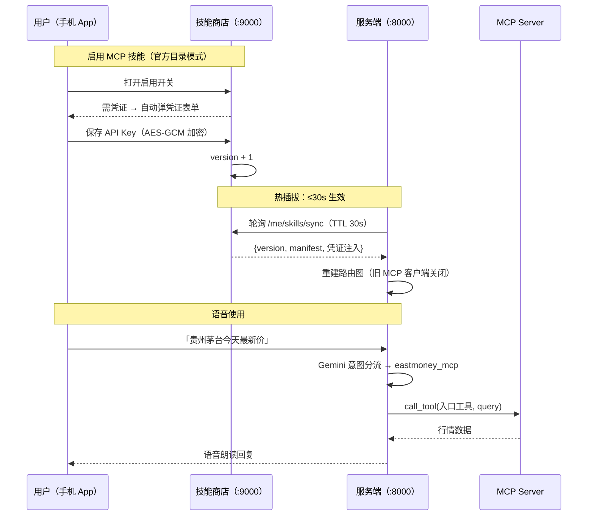

# moasm_vui_poc — 多能力语音对话助手（client-server PoC）

> **一句话**：把"出行 / 快递 / 地图 / 新闻 / 闲聊…"多个第三方能力，用一层
> **Gemini 意图分流**编排成**单一对话入口**；再拆成 **PC 服务端（大脑）+ 客户端**的
> client-server 架构，客户端含 **Python 终端版**与 **Flutter 语音版**
> （VUI：按麦克风说话 → 端侧识别 → 发请求 → 朗读回复）。
>
> 本仓库是 **PoC**（`moasm_vui` = 把第三方能力接入下一代语音助手的可行性验证）。
> **TripNow（航班管家行程引擎）只是接入的第一个 provider，并非项目本身。**
>
> 最新模型（**官方 MCP 目录模式**）：加新 MCP = 往 `skill_store/connectors/*.json` 放一个
> JSON（开发/评审），管理员只做**上架/下架**，用户启用新 MCP 时**自动弹凭证表单**填 Key 即用。
> 技术文档见 [`最终技术路线.md`](最终技术路线.md)，操作手册见 [`技能商店-使用指南.md`](技能商店-使用指南.md)，
> 代码布局见 [`docs/项目结构.md`](docs/项目结构.md)。

---
## 技能商店 + 语音路由工作流程图


---
## 项目结构：入口、编排、统一工具层、能力实现、客户端

| 顶层目录 | 角色 | 详细文档 |
|---|---|---|
| **`server_py/`** | 后端引擎：LangGraph + 统一 ToolRuntime + HTTP 服务端 | [`server_py/README.md`](server_py/README.md) |
| **`skill_store/`** | 技能商店：目录/选购/启停/凭证/上架下架（FastAPI + SQLite + connectors） | [`技能商店-使用指南.md`](技能商店-使用指南.md) |
| **`client_py/`** | Python 终端客户端（HTTP 连 `serve.py` 的参照实现） | [`client_py/README.md`](client_py/README.md) |
| **`client_flutter/`** | Flutter 手机客户端（语音版：ASR → `/chat` → TTS + 技能商店页） | [`client_flutter/README.md`](client_flutter/README.md) |
| **`ui_py/`** | 共享呈现层（Python）：`server_py`(chat_app) 与 `client_py` 共用的终端聊天气泡 | 见 server_py/README §8.9 |

> **命名约定**：Python 单元统一带 `_py` 后缀（`server_py` / `client_py` / `ui_py`），
> 与 `client_flutter` 在多语言、多端部署的仓库里一眼区分语言/平台。

```
moasm_vui_poc/                  # 仓库根（.git 在此）
├── README.md                   # ← 本文：项目总览
├── 最终技术路线.md              # 唯一权威技术文档（架构/插入技能/验收状态）
├── 技能商店-使用指南.md          # 商城/上架/加 MCP 操作手册
├── .gitignore / pytest.ini
├── requirements.txt / requirements-dev.txt
├── .env.example                # 配置模板（复制为 .env；各 key 见 server_py/README）
├── server_py/                  # 后端引擎（LangGraph + ToolRuntime + provider）
│   ├── tools/                  #    统一工具入口（Registry/Runtime/Adapter）
│   └── mcp_skill/              #    MCP 连接与 manifest 适配
├── skill_store/                # 技能商店（FastAPI + SQLite）
│   ├── connectors/             #    官方 MCP 目录（远程 MCP 技能）
│   ├── builtin_catalog.py      #    内置 Handler 的商店目录同步
│   ├── main.py                 #    商店后端（内部 :9000；手机通过主服务 :8000/skill-store 访问）
│   └── static/index.html       #    管理员控制台
├── client_py/                  # Python 终端客户端                            → 详见其 README
├── client_flutter/             # Flutter 语音客户端                           → 详见其 README
└── ui_py/                      # 共享呈现层（server_py 与 client_py 复用）
    ├── presenter.py            # Presenter 抽象 + PlainPresenter 兜底
    ├── terminal.py             # TerminalPresenter（聊天气泡风格）
    └── layout.py               # CJK 宽度/折行/画框（无副作用纯函数）
```

---

## 快速开始

```bash
# 1) 环境（仓库根目录）
python -m venv .venv
#   激活：Windows PowerShell .venv\Scripts\Activate.ps1 ；Git Bash source .venv/Scripts/activate ；*nix source .venv/bin/activate
pip install -r requirements.txt          # 跑测试再加 -r requirements-dev.txt

# 2) 配置密钥（缺哪个 key 就自动不启用哪个能力；GEMINI_API_KEY 必需）
cp .env.example .env                      # 然后编辑 .env，各能力 key 说明见 server_py/README §3 / §8.4
```

三种运行形态（命令都在仓库根目录执行）：

```bash
# A. 单机直连（无网络、最快上手）：进程内直接调 Dispatcher
python server_py/chat_app.py

# B. client-server：PC 起服务端，再用 Python 或 Flutter 客户端连
python server_py/serve.py                 # 监听 0.0.0.0:8000，控制台打印局域网地址
python -m client_py                       # Python 终端客户端（默认连 127.0.0.1:8000）
#   Flutter 客户端见 client_flutter/README.md

# C. 技能商店（MCP 目录）：B 基础上加起 mock MCP 与商店，可选购 MCP 技能
python server_py/mcp_skill/mock_server.py # mock MCP :9100（演示天气/股票/区域）
python -m uvicorn skill_store.main:app --host 0.0.0.0 --port 9000   # 技能商店 :9000
#   启动时会同时同步内置 Handler 与 connectors；管理后台 http://<PC IP>:9000/
```

技能商店相关环境变量（追加进 `.env`，详见 [`最终技术路线.md`](最终技术路线.md) §7/§14）：

```ini
SKILL_STORE_URL=http://127.0.0.1:9000     # 商店后端；留空 = 不启用商店，行为与现状一致
SKILL_STORE_USER=demo                      # 缺省 user_id（健康检查/演示用）
STORE_MASTER_KEY=<32字节hex>               # 凭证 AES-GCM 主密钥（必须来自 env，勿硬编码）
MCP_TIMEOUT=30                             # MCP 调用超时秒数
```

## 技能商店（核心能力）

- **官方 MCP 目录**：`skill_store/connectors/*.json` 声明式，商店启动幂等同步，管理员只上架/下架。
- **用户端**：启用新 MCP → 自动弹凭证表单 → 填 Key 即用；停用保留选购，退订才移除。
- **动态凭证**：按 `credentials.schema` 动态渲染表单，AES-GCM 加密存储。
- **热插拔**：任何启停/配凭证/上架操作 → 商店版本+1 → 语音助手 ≤30s 重建路由。

> 操作手册见 [`技能商店-使用指南.md`](技能商店-使用指南.md)，技术细节见 [`最终技术路线.md`](最终技术路线.md)。

- 后端引擎设计（多能力分流、各 provider 接入、测试、打包）：[`server_py/README.md`](server_py/README.md)
- HTTP 契约、CS 架构与鉴权：server_py/README §8.10
