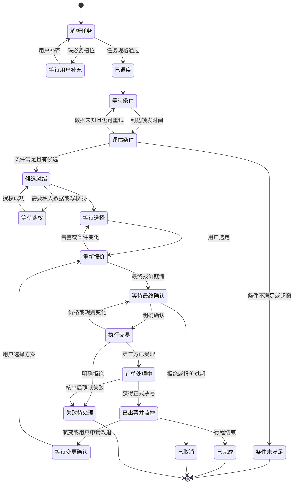

# 端云融合语音助手：最长路径与二层设计前提

> 文档用途：用一条代表性的最长业务路径，检验零层架构能否覆盖条件任务、鉴权、交易、异步状态、常驻卡片和主动提醒，并反推出 L2 详细设计的前置决策。  
> 编制：chenwj  
> 日期：2026-07-23  
> 状态：关键场景设计稿

---

## 一、结论先行

用户原例：

> 如果明天天气没有影响飞机起飞的恶劣天气，就帮我订明天上午深圳到北京的航班。

这个例子已经抓住了“条件判断 + 多能力编排 + 交易执行”，方向正确，但还不够作为架构设计的代表性最长路径。它缺少：

- 北京哪个机场、上午的时间范围、预算和直飞偏好；
- 乘机人、第三方账号授权和支付身份；
- 具体航班、最终价格、行李和退改规则；
- 用户对当前交易的明确确认；
- 下单、支付、出票的异步状态；
- 超时核单、幂等、失败恢复；
- 出票后的常驻卡片、航变监控和主动提醒。

更准确的“最长路径”定义是：

> 从用户第一次表达目标开始，一直走到条件等待、补充信息、鉴权、查询、推荐、最终报价、用户确认、交易、异步出票、常驻显示和后续航变处理的完整任务生命周期。

它不应该被画成一条超长的同步 Agent loop，而应拆成三个时间尺度：

| 时间尺度 | 典型时长 | 主体 |
|---|---|---|
| 当前会话 | 秒到分钟 | 理解目标、追问、创建任务、展示候选和确认 |
| 异步交易 | 秒到数分钟 | 占座、支付、出票、核单、失败恢复 |
| 持续任务 | 数小时到行程结束 | 等待条件、订阅事件、卡片更新、主动提醒 |

这项工作属于 L1 动态架构和关键场景设计，不是 L2 的类图或接口实现。但它必须先完成。否则 L2 无法正确决定任务归属、数据边界、确认语义、异步状态、幂等和事件模型。

---

## 二、建议采用的代表性最长任务

### 2.1 面向用户的表达

> 创建一个任务：今晚 20:00 检查明天上午深圳到北京的天气和航班。只有出发地、到达地及对应时段没有达到产品定义的恶劣天气风险，才继续找航班。我要 10:00 前起飞、直飞、含税总价不超过 1500 元且可退改的航班，两个北京机场都可以。使用我的常用乘机人和座位偏好，先把最合适的 3 个候选、实时总价和退改规则给我，等我确认后再支付出票。出票后常驻显示行程；出现恶劣天气、延误、取消或登机口变化时提醒我。改签、退票只给方案，没有再次确认不要执行。

这条任务覆盖了完整价值链：

1. 自然语言转任务规格；
2. 延迟触发和条件等待；
3. 缺失信息追问；
4. 天气与交通多能力组合；
5. 个人乘机人和偏好；
6. 用户登录、Scope 和凭证；
7. 候选筛选与推荐；
8. 报价、规则快照和确认；
9. 支付、下单和异步出票；
10. 幂等、核单与失败恢复；
11. 常驻卡片；
12. 事件订阅、主动提醒和后续改退。

### 2.2 “天气可以起飞”必须被编译成规则

天气能力只能提供观测、预报和预警，不能保证某个航班一定正常起飞。航空公司的运行状态才是最终业务事实。因此，系统应把口语条件编译成一份可审计规则，并让用户看到摘要。

```yaml
trigger:
  at: 2026-07-23T20:00:00+08:00
  deadline: 2026-07-23T22:00:00+08:00

weather_gate:
  areas: [Shenzhen_Airport, Beijing_Capital, Beijing_Daxing]
  time_window: 2026-07-24T06:00:00+08:00/2026-07-24T12:00:00+08:00
  policy_id: flight_weather_gate_v1
  max_data_age: PT30M
  unknown_behavior: stop_and_notify

flight_constraints:
  departure_before: 2026-07-24T10:00:00+08:00
  nonstop_only: true
  total_price_max: 1500 CNY
  refundable_or_changeable: true
  destination_airports: [PEK, PKX]

transaction:
  require_fresh_quote: true
  require_user_confirmation: true
  auto_payment: false

aftercare:
  persistent_card: true
  events: [weather_risk, delay, cancellation, gate_change]
```

三条规则不能让模型自由发挥：

- `UNKNOWN` 不等于条件满足；
- “没有查到恶劣天气”不等于“天气安全”；
- 天气条件满足也不等于航班运行状态正常或可售。

### 2.3 为什么不能直接把原话当成自动扣款授权

用户创建任务时还不知道具体航班、实际总价、行李额度、退改条件和支付金额。MVP 必须在拿到最终报价后再次确认。

以后可以增加“有限自动订票授权”，但它应是独立产品，不是模型对一句话的自由解释。授权至少绑定：

- 乘机人；
- 航线、机场和时间窗；
- 最高总价和币种；
- 舱位、直飞、行李和退改硬条件；
- 支付方式；
- 有效期和最多执行次数；
- 用户可随时查看和撤销的入口。

---

## 三、最长路径主泳道图

下图采用最能暴露架构问题的部署条件：

- 云端 AI 和任务引擎负责复杂理解、计划和非敏感调度；
- 每次能力调用都按 `cloud_allowed / device_only / provider_sdk_only` 选择执行位置；
- 私人票务数据若不得进入我方云，云端只保留获准的状态和 opaque 引用；
- 凭证永远不进入模型上下文；
- 高风险交易在手机侧展示不可变摘要并确认。

```mermaid
sequenceDiagram
    autonumber
    actor U as 用户
    participant D as 端<br/>眼镜＋手机
    participant C as 我方云<br/>AI＋任务引擎
    participant W as 天气能力
    participant T as 第三方票务能力

    rect rgb(238, 246, 255)
        Note over U,C: 阶段一：理解请求并创建长期任务
        U->>D: 说出条件订票任务
        D->>D: ASR、端侧分流、敏感操作预判
        D->>C: 标准化意图＋允许上传的上下文
        C->>C: 解析时间、条件、约束和风险等级
        C-->>D: 追问缺失的机场、预算或偏好
        D-->>U: 北京首都、大兴还是都可以？
        U->>D: 两个机场都可以
        D->>C: 补齐任务输入
        C->>C: 生成任务规格、位置策略和下一触发时间
        C-->>D: 返回人类可读任务摘要
        D-->>U: 展示“先推荐，确认后下单”的边界
    end

    rect rgb(245, 250, 240)
        Note over D,W: 阶段二：到点执行条件与公开查询
        C->>C: 20:00 触发任务

        alt 天气能力允许我方云调用
            C->>W: 查询机场时段天气风险
            W-->>C: 风险等级＋数据时间＋有效期
        else 天气能力只能端侧调用
            C-->>D: 下发无私人数据的调用计划
            D->>W: 端侧查询天气
            W-->>D: 天气风险结果
            D-->>C: 只回传获准结论，或不回传
        end

        C->>C: 规则引擎判断满足／不满足／未知

        alt 条件不满足
            C-->>D: 标记本次不执行并给出原因
            D-->>U: 天气条件未满足，没有进入订票
        else 结果未知或过期
            C->>C: 在截止时间内按策略重试
            C-->>D: 暂时无法可靠判断
        else 条件满足
            alt 票务能力允许我方云查询公开航班
                C->>T: 查询时段、价格、直飞等公开条件
                T-->>C: 公开候选列表＋数据时间
            else 票务能力只能端侧访问
                C-->>D: 下发经过校验的查询计划
                D->>T: 端侧查询公开航班
                T-->>D: 候选结果
            end
        end
    end

    rect rgb(255, 248, 235)
        Note over U,T: 阶段三：私人数据、报价和确认
        D->>T: 请求常用乘机人和用户偏好
        T-->>D: AUTH_REQUIRED
        D-->>U: 打开第三方系统登录授权页
        U->>T: 在第三方页面登录并授权
        T-->>D: 短期凭证、opaque 会话或 SDK 登录态

        Note over D,C: 凭证不进模型；私人结果能否回云由数据策略决定

        D->>T: 查询乘机人适用价格和规则
        T-->>D: 候选、价格、退改规则、报价有效期

        alt 候选字段允许进入我方云
            D->>C: 上传获准字段
            C->>C: 按用户硬条件排序并解释原因
            C-->>D: 返回三个候选
        else 候选不得进入我方云
            D->>D: 端侧规则/端侧模型排序<br/>或由第三方 SDK 内部完成
        end

        D-->>U: 展示候选及数据时间
        U->>D: 选择一个候选
        D->>T: 重新报价并获取最终规则快照
        T-->>D: quoteId、总价、规则、expiresAt
        D-->>U: 展示完整交易摘要并请求确认
        U->>D: 明确确认，并按需完成支付验证
    end

    rect rgb(255, 240, 240)
        Note over D,T: 阶段四：幂等下单、支付和异步出票
        D->>T: 创建订单<br/>operationId＋idempotencyKey＋quoteId
        T-->>D: ACCEPTED，orderId，状态 PENDING

        loop 直到终态或超时
            D->>T: 按 orderId 查询状态<br/>或接收第三方事件
            T-->>D: 支付、占座、出票进度
        end

        alt 出票成功
            T-->>D: TICKETED＋票号＋行程引用
            D-->>C: 只同步允许进入云端的任务状态
            D-->>U: 明确告知出票成功
        else 请求超时，结果未知
            D->>T: 按 operationId / orderId 核单
            T-->>D: 返回唯一订单状态
        else 支付或出票明确失败
            T-->>D: 失败原因＋退款/释放占座状态
            D-->>U: 告知失败和后续处理状态
        end
    end

    rect rgb(242, 242, 255)
        Note over U,T: 阶段五：常驻卡片和后续事件
        D->>T: 建立航班状态事件订阅
        D->>D: 创建常驻卡片或挂载第三方卡片

        T-->>D: 天气、延误、取消或登机口变化事件
        D->>D: 验签、去重、版本校验、免打扰判断
        D-->>U: 主动提醒并更新卡片

        alt 需要改签或退票
            D->>T: 查询实时方案和规则
            T-->>D: 返回候选方案
            D-->>U: 展示方案，等待新的明确确认
        end
    end
```



---

## 四、这条路径暴露出的四个硬约束

### 4.1 判断位置和执行位置必须分开

云端 AI 判断“下一步查航班”，不代表网络请求必须由云端发起。模型输出的是能力调用意图；受信策略层再决定执行节点。

```text
模型产生 Tool Call
        ↓
能力策略解析
        ├─ cloud_allowed      → 云侧执行器
        ├─ device_only       → 手机端执行器
        └─ provider_sdk_only → 第三方 SDK 内部工作流
```

位置策略至少取这些条件的交集：

```text
能力允许位置
∩ 数据出域规则
∩ 凭证所在位置
∩ 设备在线状态
∩ 后台可靠性要求
∩ 当前用户授权
= 本次合法执行位置
```

### 4.2 端侧专属结果会截断云端 Agent loop

若私人票务结果不能返回我方云，云端大模型不能继续基于这些数据推荐和回答。后半段必须由下列一种实现：

1. 端侧规则或端侧模型；
2. 第三方 SDK 内的推荐、确认和交易工作流；
3. 三方允许回云的有限脱敏字段。

不能把“私人数据完全不进云”和“云端 AI 自由理解私人结果”同时写进 PRD。

### 4.3 移动端后台不是可靠的永久在线服务器

Android Doze 会延迟普通后台 CPU 和网络活动；iOS 后台通知属于低优先级更新，系统不保证每次送达。因此，端侧定时轮询不能单独承担准点条件触发和实时航变提醒。[Android Doze](https://developer.android.com/training/monitoring-device-state/doze-standby)、[Apple Background Updates](https://developer.apple.com/documentation/usernotifications/pushing-background-updates-to-your-app)

若第三方禁止我方云访问，又要求较可靠提醒，第三方至少交付一种服务端能力：

- 第三方云保存订阅，并通过 APNs/FCM/OEM 通道发送事件；
- 第三方 SDK 自带后台消息服务；
- 系统推送只携带 opaque 事件 ID，端侧唤醒后直连第三方取详情。

设备打开 App、卡片刷新和定期全量同步是补偿路径。WebSocket 可用于前台实时增强，不应作为普通手机后台的唯一通道。

### 4.4 长期任务的状态不能只存在对话历史里

模型上下文会截断、模型会更换、App 和设备会重启。任务必须有确定性状态机和可恢复检查点。

如果私人数据不准进入我方云，可以拆分状态：

| 状态内容 | 推荐位置 |
|---|---|
| `task_id`、抽象状态、触发时间、设备路由 | 我方云，前提是第三方认可这些字段 |
| 航班、乘机人、报价、订单正文 | 端侧临时内存、第三方 SDK 或第三方云 |
| 最终订单事实和票号 | 第三方为权威源 |
| 常驻卡片内容 | 按合同使用批准字段＋TTL，或只存 `card_id`，或由第三方组件持有 |

---

## 五、任务状态机

A2A 规范把长期操作建模为有生命周期的 Task，并包含 `auth-required`、`input-required`、完成、失败、取消等状态。即使本项目不采用 A2A，也应采用同类状态语义，而不是把异步结果压成一次 HTTP 成功或失败。[A2A Protocol Specification](https://a2a-protocol.org/latest/specification/)



状态机的硬规则：

- `UNKNOWN` 不能当成天气条件满足；
- `ACCEPTED` 或 `PENDING` 不能向用户说“已经订好了”；
- 只有拿到权威订单状态和票号，才进入 `MONITORING`；
- 价格、航班或退改规则变化后，旧确认立即失效；
- 请求超时不等于交易失败，必须进入核单状态；
- 用户取消我方任务，不等于第三方交易一定还能撤销。

---

## 六、报价、确认与幂等

### 6.1 用户确认必须绑定一份不可变快照

```yaml
quote_id: q_123
provider: provider_x
flight_number: XX1234
departure_airport: SZX
arrival_airport: PEK
departure_time: 2026-07-24T08:10:00+08:00
passenger_summary: "陈*军 / 成人"
cabin: Economy_Y
baggage: "1件，20kg"
total_amount: 1380
currency: CNY
taxes_and_fees: 160
change_rule_summary: "..."
refund_rule_summary: "..."
quoted_at: 2026-07-23T20:03:00+08:00
expires_at: 2026-07-23T20:08:00+08:00
terms_version: v7
```

确认凭证应绑定 `quote_id` 或快照哈希。出现下列变化必须重新确认：

- 总价上涨；
- 航班、机场、日期或时间变化；
- 乘机人、舱位或行李额度变化；
- 退改条件变差；
- 报价过期。

IATA NDC 也把 Offer 与 Order 分开表达；搜索候选不是最终订单，最终交易需要基于有效 Offer 创建 Order。[IATA NDC](https://www.iata.org/en/programs/airline-distribution/retailing/ndc/)

### 6.2 标识链必须贯通

```text
user_intent_id
  → task_id
    → operation_id
      → idempotency_key
        → quote_id
          → confirmation_id
            → provider_order_id
              → payment_id / ticket_id
```

写操作要求：

- 同一次网络重试复用原 `idempotency_key`；
- 第三方返回超时后，先按 `operation_id` 或 `order_id` 核单；
- 对方不支持标准 `Idempotency-Key` 也必须提供等价的业务唯一性契约；
- 不对支付、订票、退票做无条件自动重试；
- 补偿动作需要单独状态，不能把“本地取消”当成“第三方已撤销”。

---

## 七、关键异常与正确恢复方式

| 异常点 | 正确行为 | 不能采用的做法 |
|---|---|---|
| “明天上午”“北京”等不明确 | 固化日期、时区、时间窗和机场；必要时追问 | 静默猜测后直接订票 |
| 天气接口超时或数据过期 | 标记 `UNKNOWN`，重试或通知用户 | 当成天气安全 |
| 到点时设备离线 | 在允许窗口内补执行；超窗后说明未执行 | 恢复联网后不看时间直接下单 |
| 没有符合条件的航班 | 说明是哪条约束导致无结果，请用户决定是否放宽 | 自动提高预算或更换机场 |
| 授权过期或用户拒绝 | 进入 `AUTH_REQUIRED`，成功后从安全检查点恢复 | 把账号密码写进对话或交给模型 |
| 报价失效或规则变化 | 获取新快照并重新确认 | 沿用旧确认扣款 |
| 创建订单超时 | 按幂等键、操作 ID 或订单 ID 核单 | 直接重新创建订单 |
| 支付成功但订单状态未知 | 进入对账状态，持续查询并明确告知用户 | 武断宣布成功或失败 |
| 重复或乱序事件 | 按 `event_id` 去重，按版本和时间校验迁移 | 重复提醒或重复执行 |
| 航班取消，需要改签 | 查询并展示新方案，再次确认后执行 | 把首次订票授权扩展成自动改签 |
| 用户在出票中取消 | 判断是否越过不可逆点，必要时转退票流程 | 只改本地状态就认为已取消 |

---

## 八、结构化能力与黑盒 SDK 如何走同一条产品路径

两类方案都能交付完整体验，差别是实现责任和数据控制权。

| 环节 | 结构化接口/传输 SDK | 黑盒产品 SDK |
|---|---|---|
| 缺槽追问 | 我方 AI 与 UI | 第三方工作流可自己追问，或由双方约定输入参数 |
| 航班候选 | 我方端侧获得结构化数据 | 第三方 SDK 内部展示 |
| 候选排序 | 我方规则、端侧模型或获准云模型 | 第三方 SDK 完成 |
| 最终报价 | 我方端侧获得报价快照 | SDK 内部展示和确认 |
| 支付与订票 | 我方调用交易接口并承担幂等和状态管理 | SDK 内部完成 |
| 常驻卡片 | 我方生成；受数据存储许可限制 | 第三方提供卡片组件和刷新逻辑 |
| 航变提醒 | 我方消费事件并呈现 | 第三方 SDK 订阅、过滤和提醒 |
| AI 可见程度 | 由数据出域策略决定 | 可以完全不可见，只给 opaque 状态 |
| 产品迭代 | 我方可组合已有能力 | 依赖第三方修改和发布 SDK |

所以，黑盒 SDK 不是“做不到最长路径”，而是第三方必须把这些能力完整做进去：

- 登录授权与断点恢复；
- 候选、报价、确认、支付和出票；
- 订单核单、失败恢复和售后；
- 常驻卡片；
- 航变订阅和提醒；
- 改签、退票的二次确认流程；
- 可供我方宿主读取的 opaque workflow ID、状态、错误码和 Trace ID。

我方语音助手负责启动、承载、恢复或关闭该工作流，不能在看不到数据时假装自己完成了内部编排。

---

## 九、由最长路径反推出的 L2 设计前提

这条最长路径逼出了 10 份必须先冻结的契约。

### 9.1 长期任务契约

```yaml
task_id: ...
task_type: conditional_trip_booking
owner: our_cloud | device | provider_sdk | provider_cloud
state: ...
trigger_time: ...
deadline: ...
timezone: ...
next_run_at: ...
execution_policy_ref: ...
risk_level: ...
auth_context_ref: ...
provider_task_ref: ...
created_at: ...
updated_at: ...
```

首先决定任务由谁持有。若只能端侧持有，就必须接受设备离线、进程被杀和后台受限的现实；若第三方持有，就要有工作流状态 API；若我方云持有，就要证明云端保存的字段符合数据约束。

### 9.2 能力契约

每个能力除输入输出外，还要声明：

```text
side_effect_level
data_classification
allowed_execution_location
result_egress
required_auth_scope
sync_or_async
timeout_policy
retry_policy
idempotency_support
compensation_support
event_support
presentation_mode
```

### 9.3 数据与执行位置契约

逐字段确认：

- 是否允许进入我方云；
- 是否允许出现在我方端侧业务代码；
- 是否只能留在第三方 SDK；
- 是否允许进入端侧或云端模型；
- 是否允许临时内存、落盘、日志和崩溃转储；
- 允许回传原始值、脱敏值，还是只有 opaque 状态。

### 9.4 风险与确认契约

| 等级 | 示例 | 产品策略 |
|---|---|---|
| R0 | 公开天气、公开航班 | 可直接执行 |
| R1 | 私人行程、乘机人只读 | 需要用户授权，不必每次确认 |
| R2 | 创建长期监控和提醒订阅 | 创建时展示任务摘要，可随时撤销 |
| R3 | 订票、支付、改签、退票 | 绑定最终快照，明确确认 |
| R4 | 自动扣款或有限自动订票 | 单独授权，限制对象、金额、时间、次数和撤销方式 |

### 9.5 报价与确认契约

必须回答：

- 报价有效多久；
- 哪些字段变化会使旧确认失效；
- 确认如何绑定快照；
- 支付验证发生在哪一侧；
- 用户确认后、真正下单前是否再次报价。

### 9.6 交易幂等、核单和补偿契约

双方冻结：

- 幂等键生成、有效期和重试规则；
- 网络超时后的订单查询方法；
- `ACCEPTED / PROCESSING / SUCCEEDED / FAILED / UNKNOWN` 的精确定义；
- 支付成功但出票失败时的退款责任和状态；
- 取消、退票等补偿动作的不可逆点。

### 9.7 异步任务契约

至少定义：

- 提交后立即返回什么；
- 哪个状态才算成功；
- 轮询间隔和最大等待时间；
- 是否支持流式状态、推送和取消；
- 超时或重启后如何恢复。

### 9.8 事件与主动提醒契约

```yaml
event_id: ...
subscription_id: ...
task_or_order_ref: ...
event_type: delay
revision: 17
occurred_at: ...
expires_at: ...
source: ...
payload_ref: ...
```

同时定义事件验签、去重、乱序、订阅续期、推送丢失后的补拉，以及用户撤销授权后的清理。

### 9.9 UI 与黑盒工作流契约

能力声明呈现模式：

```text
structured_data
provider_card
provider_fullscreen_ui
opaque_workflow
text_only
```

黑盒 SDK 不能只提供 `openPage()`。它至少返回工作流 ID、当前状态、是否可恢复、是否等待用户输入/鉴权/确认、是否完成或取消，以及卡片和提醒入口。

### 9.10 审计与可观测性契约

系统要能回答：

- 哪个用户意图创建了哪个任务；
- AI 提议了什么；
- 策略层批准了什么；
- 用户确认的是哪份报价；
- 谁在什么位置调用了哪一版能力；
- 第三方返回了什么状态；
- 重试、核单和补偿如何发生。

日志保留标识、状态、策略版本和错误码，不记录 Token、支付凭据或合同禁止保存的私人正文。

---

## 十、L0、L1、L2 的边界

| 层级 | 要回答的问题 | 本文的覆盖程度 |
|---|---|---|
| L0 零层架构 | 有哪些系统域；请求和数据从哪里到哪里；谁能调用第三方 | Part1 已完成 |
| L1 功能与动态架构 | 任务、策略、鉴权、执行、事件、UI 如何协作 | 本文主体 |
| L2 详细设计 | 状态对象、接口 Schema、SDK API、进程线程、数据库、加密存储和事件格式 | 本文冻结前提，尚未展开到实现 |

因此，“想清楚最长路径才能开始二层设计”这个判断成立。更精确的说法是：

> Part2 是 L1 关键场景和动态架构，同时负责冻结 L2 的输入条件。没有它，直接画类图或定义 SDK API，后面会因任务归属、数据边界和交易语义不清而反复推翻。

---

## 十一、参考资料

- [A2A Protocol：有状态 Task、异步处理、流和推送](https://a2a-protocol.org/latest/specification/)
- [MCP Tools：工具结构、结果校验、超时、确认与审计](https://modelcontextprotocol.io/specification/2025-11-25/server/tools)
- [RFC 8252：Native App OAuth 与 PKCE](https://www.rfc-editor.org/rfc/rfc8252.html)
- [RFC 9700：OAuth 2.0 Security Best Current Practice](https://www.rfc-editor.org/rfc/rfc9700.html)
- [Android Doze 与 App Standby](https://developer.android.com/training/monitoring-device-state/doze-standby)
- [FCM Android Message Priority](https://firebase.google.com/docs/cloud-messaging/android-message-priority)
- [Apple：Pushing Background Updates to Your App](https://developer.apple.com/documentation/usernotifications/pushing-background-updates-to-your-app)
- [CloudEvents：事件 ID、来源、类型与重复识别](https://github.com/cloudevents/spec/blob/main/cloudevents/spec.md)
- [IATA New Distribution Capability](https://www.iata.org/en/programs/airline-distribution/retailing/ndc/)

