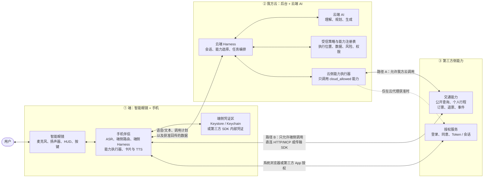
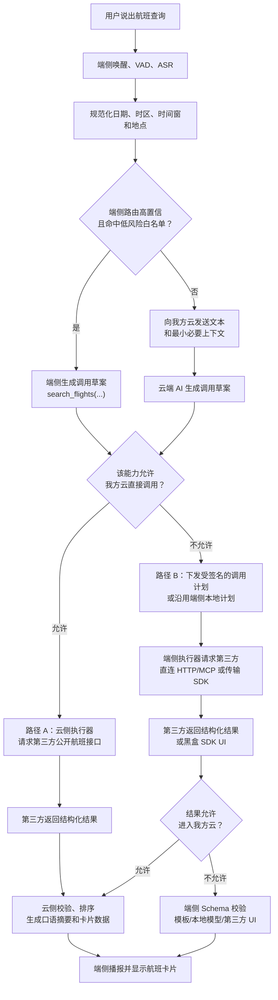
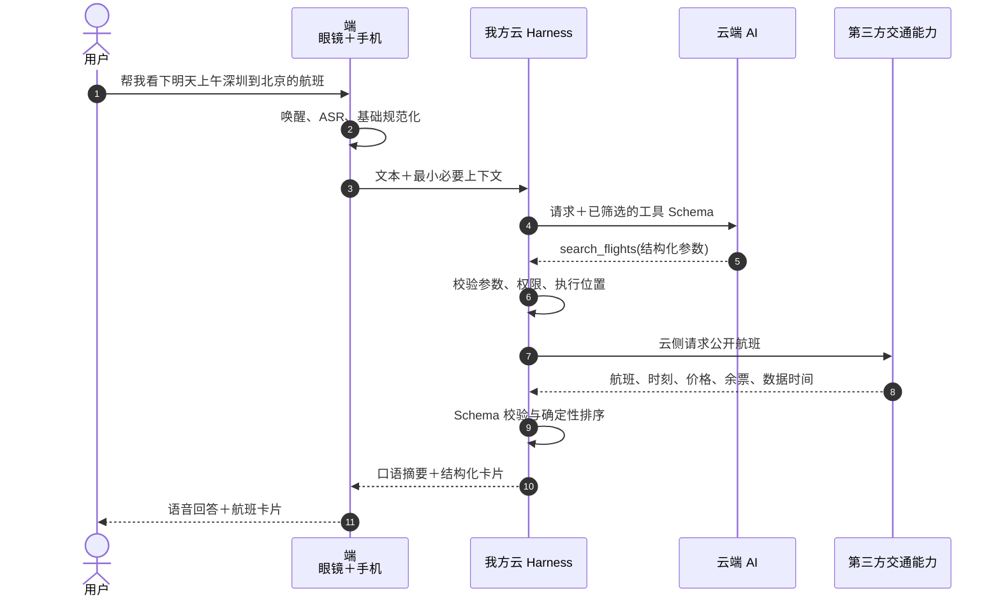
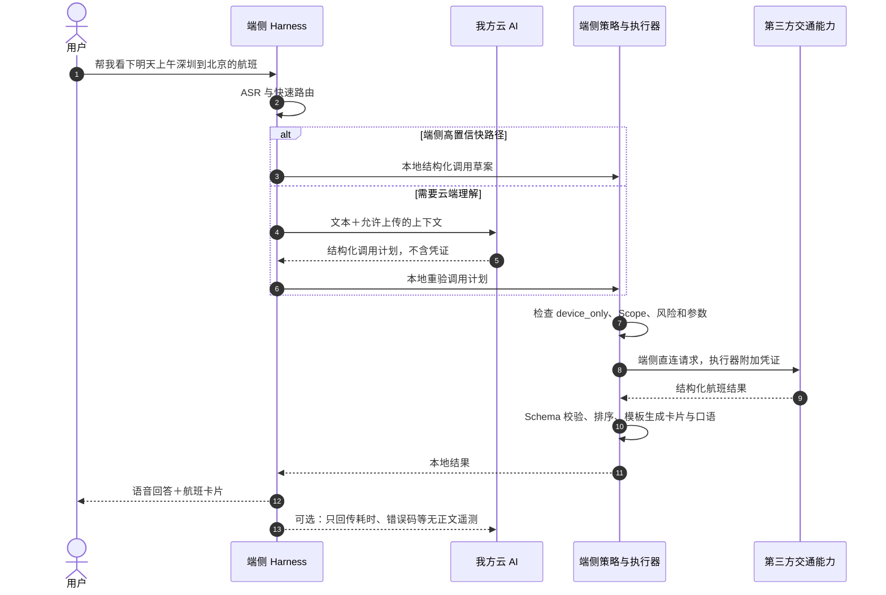
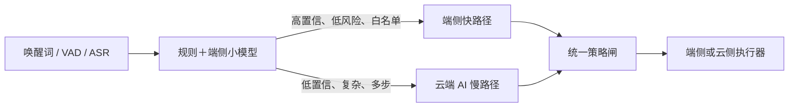
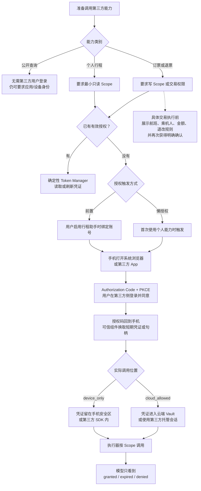

# 端云融合语音助手：零层架构与主流程

> 文档用途：说明端云融合语音助手如何接入第三方云能力，并明确云侧调用、端侧调用、结果回流和鉴权边界。  
> 编制：chenwj  
> 日期：2026-07-23  
> 状态：零层方案评审稿

---

## 一、先看结论

“端、我方云、第三方”这三个系统域是正确的零层划分，不需要为了端侧小模型、鉴权或能力注册再增加第四个系统域。用户是系统外部参与者；端侧小模型属于“端”；授权服务属于“第三方”；能力目录和数据策略是跨域契约。

但原始三域模型还缺 5 条关系。少了其中任何一条，后续方案都容易把“AI 在哪里思考”和“请求从哪里发出”混在一起。

| 必须补上的关系 | 要回答的问题 |
|---|---|
| 能力执行位置 | 该能力允许我方云调用，还是只能由手机/眼镜调用？ |
| 结果出域范围 | 端侧拿到结果后，能否再送入我方云或云端模型？ |
| 鉴权层次 | 当前调用依赖应用身份、设备身份、用户授权，还是一次交易确认？ |
| 风险等级 | 公开查询、私人只读、订退票分别经过什么权限和确认闸？ |
| 结果呈现权 | 我方拿结构化数据生成语音和卡片，还是只承载第三方 SDK 的黑盒 UI？ |

本方案最重要的判断是：

> AI 在哪里决定调用能力，与网络请求最终从哪里发出，是两个独立问题。

例如，云端 AI 可以决定调用 `search_flights`，再把经过校验的结构化调用计划交给手机执行；端侧小模型也可以在高置信、低风险场景直接命中本地快路径。真正的执行位置由确定性策略决定，不由模型临场选择。

对于示例“帮我看下明天上午深圳到北京的航班”：

- 这是公开只读查询，通常不需要用户登录第三方账号；
- 它仍可能需要我方应用身份、设备注册、调用签名或配额凭证；
- “明天”“上午”“深圳到北京”必须被规范化为日期、时区、时间窗和机场范围；
- 第三方若允许我方云调用，可走云侧闭环；若只允许设备调用，则由手机执行；
- 即使只能端侧发请求，结果能否回云仍要单独判断。

鉴权建议采用分级混合策略：

> 公开能力免用户登录；个人能力默认懒鉴权；启用常驻行程和主动提醒时前置只读授权；订票、退票在执行前增量升权，并对具体交易再次确认。

---

## 二、三域零层图

### 2.1 零层只表达部署与信任边界



这张图有四点需要直接读出来：

1. 眼镜和手机同属“端”。默认由手机承担登录、凭证保管、网络访问和复杂 UI；眼镜主要负责第一视角输入与轻量反馈。
2. 云端 AI 不直接持有网络权限。模型产生调用建议，由 Harness 和策略层审核后交给云侧或端侧执行器。
3. 第三方允许我方云调用时，云端可以完成标准的“规划 → 调用 → 观察 → 继续推理”闭环。
4. 第三方只允许端侧调用时，云端可以做规划，但执行一定落在手机或独立眼镜。结果若也不准回云，闭环的后半段必须留在端侧或第三方 SDK 内。

### 2.2 协议、执行位置和交付形态是三件事

| 维度 | 典型选项 | 它决定什么 |
|---|---|---|
| 调用协议 | REST/OpenAPI、MCP、厂商私有 API | 请求和响应如何描述 |
| 执行位置 | 我方云、手机、独立眼镜、第三方 SDK 内 | 网络请求从哪里真正发出 |
| 交付形态 | 裸 HTTP、无 UI 传输 SDK、黑盒产品 SDK | 谁控制网络实现、业务数据和 UI |

因此：

- 远程 MCP 的标准传输本身就是 HTTP；MCP 不等于“必须云调”。MCP 也支持本地 `stdio` 和可插拔自定义传输。[MCP Transports](https://modelcontextprotocol.io/specification/2025-11-25/basic/transports)
- 第三方 SDK 若只封装网络、鉴权和风控，并向我方返回结构化结果，它仍属于接口型能力。
- 第三方 SDK 若不暴露数据，只返回查询 UI、卡片、音频或完整工作流，则属于黑盒产品能力。它仍能做回答、常驻卡片和提醒，只是产品实现权在第三方。

---

## 三、调用位置不是唯一的数据边界

“第三方是否允许我方云访问”至少要拆成下面四个问题。合同和能力注册表都应逐项填写，不能只给一个“允许/不允许”。

| 策略项 | 示例值 | 含义 |
|---|---|---|
| `request_origin` | `cloud_allowed` / `device_only` / `provider_sdk_only` | 谁能向第三方发请求 |
| `result_egress` | `cloud_allowed` / `redacted_only` / `device_only` / `provider_only` | 结果可以进入哪里 |
| `persistence` | `forbidden` / `memory_only` / `ttl_cache` / `approved_fields` | 哪些位置可以保留多久 |
| `presentation` | `structured` / `provider_card` / `opaque_ui` | 谁读取数据并生成最终体验 |

这四项可以形成不同的合法组合：

| 组合 | 可实现的链路 |
|---|---|
| 云可调用，结果可回云 | 云端完整 Agent 闭环，由我方生成回答和卡片 |
| 只能端侧调用，结果可回云 | 端侧代发请求，云端继续理解和生成结果 |
| 只能端侧调用，结果不得回云 | 云端只下发调用计划，端侧完成总结、卡片与 TTS |
| 结果只能留在第三方 SDK | 我方启动或承载黑盒 UI/音频，不读取正文 |

这里最容易出现的错误需求是：一边要求“私人数据不能进入我方云”，一边要求“云端 AI 根据私人结果继续自由推理”。两者不能同时成立。可选办法只有三个：

- 端侧模板或端侧模型完成后续处理；
- 第三方 SDK 内部完成处理并返回黑盒结果；
- 第三方批准一组可回云的最小、脱敏字段。

### 3.1 建议的最小能力策略

```yaml
capability_id: trip.flight.search
data_class: public

execution_policy:
  request_origin: cloud_allowed  # 或 device_only / provider_sdk_only

result_policy:
  cloud_egress: allowed          # 或 redacted_only / forbidden
  persistence: no_persist
  presentation: structured       # 或 provider_card / opaque_ui

auth_policy:
  principal: app_and_device
  user_scope: none
  credential_holder: device      # 或 our_cloud / provider_sdk

risk_policy:
  level: read
  confirmation: none
```

能力描述符由我方受信注册表维护。模型可以看到工具名称、描述和参数 Schema，但不能修改执行位置、数据出域、风险和鉴权策略。

---

## 四、简单案例的骨干流程

用户请求：

> 帮我看下明天上午深圳到北京的航班。

### 4.1 请求规范化

执行前至少要得到下面这份结构化请求：

```yaml
tool: search_flights
arguments:
  origin_city: Shenzhen
  destination_city: Beijing
  departure_date: 2026-07-24
  departure_time:
    start: "06:00"
    end: "12:00"
  timezone: Asia/Shanghai
```

产品还需冻结三条口径：

- “明天”使用设备当前时区，还是出发地时区；
- “上午”是 `00:00–12:00`、`06:00–12:00`，还是可配置时间窗；
- 城市级搜索是否自动覆盖深圳宝安、北京首都和北京大兴，还是先追问机场。

这些属于确定性产品规则。模型可以抽取用户表达，但不能为交易链路私自发明规则。

### 4.2 主流程与两条执行路径



### 4.3 路径 A：我方云可直接调用



这条路径最容易形成完整 Agent loop，也适合后台长任务。但它成立的前提是第三方明确允许：

- 请求由我方云发起；
- 对应数据进入我方云内存和处理链路；
- 使用的模型供应商和日志策略符合双方约定；
- 凭证可以合法存放在我方云的凭证保险箱中。

### 4.4 路径 B：只能由端侧调用

下面画的是更严格的情况：网络请求和结果处理都不得进入我方云。



云端下发的必须是结构化调用计划，而不是一段“请访问某 URL”的自然语言。端侧至少校验：

```yaml
plan_id: 9e8d...
capability_id: trip.flight.search
capability_version: 1.0.0
arguments: {...}
issued_at: 2026-07-23T10:00:00+08:00
expires_at: 2026-07-23T10:00:30+08:00
requested_data_policy: public_only
trace_id: 4f31...
```

端侧执行器有权拒绝过期、越权、参数不合法或与本地策略不一致的计划。

---

## 五、端侧小模型放在哪里、做什么

端侧小模型放在手机侧路由层。眼镜算力足够时可以前移一部分，但逻辑位置不变。



它适合做：

- 高频意图分流，例如天气、航班查询、音量和播放控制；
- 日期、地点、航班号等有限槽位抽取；
- 离线时的基础控制和隐私敏感快路径；
- 云端不可用时的明确降级。

它不负责：

- 决定自己是否有权限调用某能力；
- 绕过写操作确认；
- 在低置信时猜测交易参数；
- 承担所有复杂多步规划。

Android 已提供明确的端侧语音识别入口 `createOnDeviceSpeechRecognizer`；端侧 ASR 在产品上可行，但仍要检查具体设备和语言是否支持。[Android SpeechRecognizer](https://developer.android.com/reference/android/speech/SpeechRecognizer.html)

建议把路由输出设计成“候选意图＋置信度＋参数”，再由确定性策略层裁决。例如：

```json
{
  "intent": "trip.flight.search",
  "confidence": 0.96,
  "slots": {
    "origin": "深圳",
    "destination": "北京",
    "date": "2026-07-24",
    "time_window": "morning"
  }
}
```

---

## 六、鉴权单独作图

鉴权不应塞进简单查询主图。公开查询大多数时候不会触发用户登录，把完整 OAuth 流程混在主链路里反而掩盖重点。

### 6.1 鉴权与交易确认流程



### 6.2 推荐的触发策略

| 能力 | 推荐时机 | 原因 |
|---|---|---|
| 公开航班、高铁查询 | 不要求第三方用户登录 | 先完成低风险查询，降低首用门槛 |
| 个人行程查询 | 首次使用时懒授权；也允许用户在设置中主动绑定 | 不为尚未使用的能力提前索取权限 |
| 常驻行程、主动提醒 | 用户启用功能时前置只读授权 | 后台事件发生时不能再等待用户临时登录 |
| 订票、退票 | 执行前增量申请写权限，并对当前交易再次确认 | 账号授权不等于同意某一笔交易 |

### 6.3 四种身份与权限不能混用

| 层次 | 证明什么 | 典型机制 |
|---|---|---|
| 我方账号身份 | 当前会话属于哪个我方用户 | 我方账号、设备绑定 |
| 我方应用/设备身份 | 请求来自合法客户端实例 | `client_id`、SDK 注册、设备证明、实例密钥 |
| 第三方用户授权 | 用户允许读取或操作哪些第三方资源 | OAuth Scope、Access Token |
| 当前交易确认 | 用户同意这一次具体的订票或退票 | 报价快照、明确确认、一次性确认凭证 |

设备证明只能说明“像一台合法设备”，不能代替用户授权；OAuth 只说明“允许这个客户端访问某类资源”，也不能代替当前交易确认。

---

## 七、凭证放在哪里

### 7.1 凭证落点矩阵

| 第三方约束 | 请求发起点 | 建议凭证落点 | 云端 AI 可见内容 |
|---|---|---|---|
| 允许我方云调用和处理结果 | 我方云 | KMS/HSM 支持的云端 Vault，或第三方托管会话句柄 | 仅获准业务数据，不见 Token |
| 禁止我方云访问，但端侧可拿结构化结果 | 手机 | 手机安全存储；尽量使用短时、设备绑定凭证 | 调用计划、授权状态；结果能否回云另行约定 |
| 只允许第三方 SDK 黑盒处理 | 第三方 SDK | SDK 内部或第三方进程 | `connected`、`expired`、`result_ready` 等状态 |

推荐的凭证分工是：

- `client_id` 可以公开，用于标识我方渠道，不能当成秘密；
- App 内不硬编码可被所有安装实例复用的 `client_secret`；
- Access Token 短时、最小 Scope、限定目标资源；
- Refresh Token 优先由第三方 token broker 保存，或采用轮换/发送者约束；
- 交易确认使用短期、一次性凭证，绑定用户、动作、报价和失效时间；
- 模型、提示词、普通日志、埋点和崩溃报告都不接触凭证。

原生 App 应通过外部浏览器或第三方 App 完成 Authorization Code + PKCE，而不是在我方可读取页面内容的 WebView 中收集账号密码。RFC 8252 明确要求原生应用使用外部 user-agent，并要求公共原生客户端使用 PKCE。[RFC 8252](https://www.rfc-editor.org/rfc/rfc8252.html)

OAuth 安全最佳实践还要求缩小权限、避免令牌重放，并限制令牌适用的资源。若端侧风险较高，可进一步评估 DPoP，把 Token 的使用绑定到设备持有的非导出私钥。[RFC 9700](https://www.rfc-editor.org/rfc/rfc9700.html)、[RFC 8707](https://www.rfc-editor.org/rfc/rfc8707.html)、[RFC 9449](https://www.rfc-editor.org/rfc/rfc9449.html)

如果第三方仍要求提供“永久 key”，最低条件是：单用户或单安装实例、可撤销、可轮换、最小 Scope、服务端可查看活跃设备，且不能是写死在 APK/IPA 中的全局万能 key。

### 7.2 眼镜如何完成登录

默认在配对手机完成登录和授权。眼镜只提示“请在手机上完成账号绑定”，并在授权完成后恢复原任务。

只有独立眼镜既没有合适浏览器、又无法把登录转移到手机时，才考虑 OAuth Device Authorization Grant。这类流程专门服务输入受限设备，但会增加跨设备确认和防钓鱼要求。[RFC 8628](https://www.rfc-editor.org/rfc/rfc8628.html)

---

## 八、三域职责表

| 责任 | 端 | 我方云 | 第三方 |
|---|---|---|---|
| 唤醒、采音、显示、播报 | 主责 | 不参与硬件闭环 | 不参与 |
| 端侧 ASR 与快速路由 | 主责 | 提供模型或规则版本可选 | 不参与 |
| 复杂自然语言理解与规划 | 可做降级 | 主责 | 黑盒 SDK 方案下可由第三方承担 |
| 执行位置和数据策略 | 本地强制校验 | 统一策略与注册表 | 声明并在服务端强制执行 |
| 公开能力调用 | `device_only` 时主责 | `cloud_allowed` 时主责 | 提供事实数据与 SLA |
| 用户登录、授权、发 Token | 发起并承载系统授权页 | 仅在云调用获准时参与回调 | 主责 |
| 私人数据与交易事实 | 按合同临时处理 | 只有明确获准时处理 | 事实来源与最终裁决方 |
| 卡片与 TTS | 端侧最终渲染 | 可生成结构化呈现描述 | 黑盒方案下直接生成 UI/音频 |
| 凭证保护 | device-only 模式主责 | cloud 模式主责 | 签发、轮换、撤销、校验 |

---

## 九、进入下一层设计前必须冻结的决策

1. 对每个能力分别标记 `cloud_allowed`、`device_only` 或 `provider_sdk_only`，不能对整个第三方只给一个总开关。
2. 单独确认结果能否进入我方云内存、模型上下文、日志、缓存和长期存储。
3. 确认手机是否是默认能力宿主，哪些独立眼镜型号具备直接执行条件。
4. 冻结公开查询中的日期、时区、时间窗和城市到机场的映射规则。
5. 确认云端产生的端侧调用计划格式、签名、TTL、重放防护和拒绝策略。
6. 冻结公开、私人只读、订阅、交易四类 Scope 和确认规则。
7. 决定 Refresh Token 由第三方 broker、端侧安全区还是我方云 Vault 持有。
8. 确认结构化结果、第三方卡片和黑盒 UI 三种呈现模式各自的宿主 API。
9. 定义超时、错误码、数据新鲜度、Trace ID 和最小无正文遥测。

完成这 9 项后，零层架构才真正具备进入 L1 功能分解和 L2 详细设计的条件。

---

## 十、参考资料

- [MCP Architecture：Host、Client、Server 及安全边界](https://modelcontextprotocol.io/specification/2025-11-25/architecture)
- [MCP Tools：工具发现、调用、结构化结果与确认要求](https://modelcontextprotocol.io/specification/2025-11-25/server/tools)
- [MCP Transports：stdio 与 Streamable HTTP](https://modelcontextprotocol.io/specification/2025-11-25/basic/transports)
- [MCP Authorization](https://modelcontextprotocol.io/specification/2025-11-25/basic/authorization)
- [RFC 8252：OAuth 2.0 for Native Apps](https://www.rfc-editor.org/rfc/rfc8252.html)
- [RFC 9700：OAuth 2.0 Security Best Current Practice](https://www.rfc-editor.org/rfc/rfc9700.html)
- [RFC 8707：Resource Indicators for OAuth 2.0](https://www.rfc-editor.org/rfc/rfc8707.html)
- [RFC 9449：DPoP](https://www.rfc-editor.org/rfc/rfc9449.html)
- [RFC 8628：OAuth Device Authorization Grant](https://www.rfc-editor.org/rfc/rfc8628.html)
- [Android SpeechRecognizer](https://developer.android.com/reference/android/speech/SpeechRecognizer.html)
