# 第三方交通出行能力接入技术评估

> 文档用途：明确两种合作方式各自能交付的产品、技术前提和责任边界，供双方产品、研发、安全及合规评审使用。  
> 编制：chenwj  
> 日期：2026-07-22  
> 状态：方案评审稿

---

## 一、结论先行

两种方案都可以做出“语音问私人行程、常驻卡片、主动提醒、订退票”这些用户可见功能。真正的差别不是功能有没有，而是**数据和产品逻辑由谁掌握、UI 由谁生成、需求变化后由谁修改**。

| 方案 | 我方实际拿到什么 | 产品逻辑与 UI 的归属 | 主要特征 |
|---|---|---|---|
| 方案一：开放能力接口 | 我方端侧拿到公开/私人数据、交易动作和事件的机器可读结果 | 我方编排、我方生成语音与 UI、我方决定提醒规则 | 网络调用必须从手机/眼镜发起；可以直连 HTTP，也可以由对方传输型 SDK 代发 |
| 方案二：端侧 SDK 黑盒能力 | 查询结果 UI、交易 UI、常驻卡片、通知等不透明能力面 | 对方在 SDK 内读取数据并生成 UI/语音/提醒，我方只负责调用、承载和生命周期 | 数据对我方业务代码不可见；产品细节和迭代依赖对方实现 |

五个判断需要在立项前达成一致：

1. **黑盒 UI 也是一种有效回答。**用户说“看下我的行程”后，对方 SDK 可以返回一个包含个人行程的 UI，由我方助手承载显示；若还要语音播报，对方 SDK 可以同时返回或直接播放不透明音频。用户获得了回答，但我方业务代码不知道回答内容。
2. **“不准存储”不能只写成一句原则。**必须分别定义凭证、原始行程、派生信息、订单状态、日志、模型上下文、崩溃信息和备份是否允许落盘、允许停留多久、允许在哪一侧处理。
3. **MCP 与 REST/OpenAPI 主要是接入协议的差异，不是产品能力的差异。**只要工具集合、数据结构、授权和事件能力相同，两者能做出的产品基本相同。MCP 本身不会自动解决授权、合规、确认和数据留存问题。
4. **常驻卡片和主动推送在两种方案中都可实现。**方案一由我方根据数据和事件实现；方案二由双方先确定产品形态，再由对方把卡片渲染、数据刷新、事件监听和通知逻辑做进 SDK。
5. **选择依据是控制权与责任归属。**方案一要求我方进入数据处理链路，换来更高的编排自由度；方案二把数据和垂直产品逻辑留给对方，换来更清晰的数据边界，但新增样式、规则和场景通常需要对方重新开发、测试和发布 SDK。

新增“禁止三方云访问、只能设备访问”的约束后，方案一内部还要再选一次：

| 端侧接入形态 | 数据是否给我方 | 谁发起网络请求 | 归属 |
|---|---|---|---|
| 我方端侧直连 HTTP | 给我方结构化数据 | 我方 App 的 HTTP/MCP client | 方案一 A |
| 对方传输型 SDK | 给我方结构化数据 | 对方 SDK 内部的网络模块 | 方案一 B |
| 对方黑盒产品 SDK | 不给数据，只给 UI/音频/卡片 | 对方 SDK | 方案二 |

当前选型倾向是：**手机端优先采用方案一 B，即对方提供无 UI 绑定的传输型 SDK；推送采用“系统推送发送无数据唤醒信号，SDK 在设备上直连对方回源取数”。系统推送凭证优先由我方掌握，只允许 opaque Webhook 进入我方推送中继；若对方连这类元数据也不允许经过我方云，则由对方直发 APNs/FCM。WebSocket 作为前台实时增强，不作为普通手机后台的唯一通道。**

一句话概括选择逻辑：

> 两种方案可以交付相近的用户表象。方案一是“对方给能力，我方做产品”；方案二是“双方定产品，对方把产品做进 SDK，我方承载黑盒结果”。

---

## 二、项目目标与边界

### 2.1 产品目标

本项目希望把第三方交通能力接入智能眼镜及手机上的 AI 助手，覆盖四类场景：

| 场景 | 示例 | 期望呈现 |
|---|---|---|
| 公开查询 | “明天下午上海到北京还有哪些高铁？” | 语音简答 + 可展开的车次卡片 |
| 私人查询 | “我的航班几点登机？有没有延误？” | 直接回答 + 当前行程卡片 |
| 交易操作 | “帮我订明早去深圳的票”“把这张票退了” | AI 收集条件，对方计价，用户确认后执行 |
| 行程伴随 | 临近出发、值机、延误、检票口变化 | 常驻卡片、眼镜 HUD、手机通知或语音提醒 |

### 2.2 顶层软件模型

大模型可以理解语言、进行推理，并在有限上下文内组合信息，但它本身不能读取行程、订票或推送通知。产品必须在模型之外补齐三层：

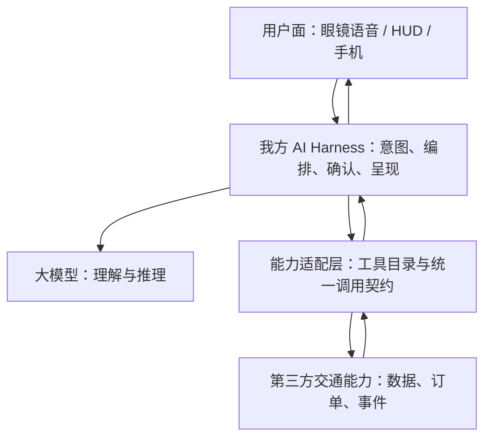

方案一接入的是“能力适配层”，我方可以读取结构化结果并自由编排、呈现。方案二由对方 SDK 纵向贯穿能力和用户面：我方 Harness 发出意图调用，SDK 内部完成数据访问、业务判断和 UI/音频生成，再把不透明的呈现面交给我方承载。两者可以做出相近界面，但控制权不同。

### 2.3 本文所说的“存储”

在双方未另行签署数据定义前，不能把“数据库不落表”等同于“不存储”。以下位置都可能形成副本：

- 手机文件、数据库、SharedPreferences、Keychain/Keystore、WebView 缓存；
- 服务端数据库、Redis、消息队列、对象存储、搜索索引和向量库；
- HTTP access log、应用日志、APM trace、崩溃转储、请求重放系统；
- 对话历史、模型输入输出、模型供应商日志和评测数据集；
- 截图、通知历史、系统最近任务缩略图、备份及容灾副本。

因此，合规条款至少要区分：

| 动作 | 含义 | 对完整助手体验的影响 |
|---|---|---|
| 传输 | 语义数据经过我方网络或暴露给我方业务接口 | 禁止传输时，仍可由 SDK 内部取数并输出黑盒 UI/音频 |
| 处理 | 我方代码或模型读取、转换或判断数据 | 禁止我方处理时，回答、卡片和提醒必须由对方 SDK 生成 |
| 临时缓存 | 为一次展示或重试短暂停留 | 禁止缓存时，弱网、离线和常驻卡片能力受限 |
| 持久化 | 数据跨请求、跨进程或跨重启保留 | 禁止持久化仍可做实时问答，但需要专门关闭日志和会话留存 |
| 派生存储 | 保存“明早 8 点有行程”等由原始数据计算出的事实 | 这仍可能是私人行程数据，不能默认视为脱敏 |

---

## 三、哪些环节需要 AI，哪些不需要

AI 不应被当成所有功能的后台定时器。交通场景对正确性、时效性和可追责性要求高，稳定做法是“AI 负责理解和表达，确定性系统负责状态和执行”。

| 环节 | 是否需要 AI | 推荐实现 |
|---|---|---|
| 判断用户是在查公开车次还是自己的订单 | 需要 | 大模型 function calling 或轻量意图分类 |
| 从口语中提取出发地、日期、席别等参数 | 需要 | 大模型抽槽；执行前做格式和业务校验 |
| 查询航班、高铁、订单 | 不需要 | 直接调用确定性接口 |
| 选择候选行程 | 可选 | AI 可解释和排序，但票价、余票和规则以对方返回为准 |
| 创建订单草稿 | 不需要 | 交易接口执行，不允许模型自行伪造参数 |
| 支付、出票、退票 | 不需要 AI 决策 | 用户确认 + 确定性交易接口；AI 只负责对话 |
| 生成天气或行程卡片布局 | 通常不需要 | 结构化数据映射固定模板，稳定且可测试 |
| 监控延误、检票口变化、出发时间 | 不需要 | 对方事件流或规则引擎 |
| 决定是否打扰用户 | 可部分使用 | 硬规则先过滤；AI 可在脱敏后参与优先级和措辞 |
| “以后航班延误超过 30 分钟就提醒我” | 首次需要 | AI 把自然语言编译为规则，用户确认后由规则引擎长期执行 |

常驻卡片是一个持续读取状态并渲染的 UI 容器；主动推送是事件源、订阅规则和投递通道的组合。两者都不要求大模型常驻运行。在方案一中，这套确定性逻辑由我方实现；在方案二中，由对方实现在 SDK 及其云端服务内。把它们强行做成 agent loop，会增加延迟、费用和不可预测性。

---

## 四、方案一：开放能力接口

### 4.1 方案定义

第三方提供 REST/OpenAPI、OpenAI 兼容接口或远程 MCP 服务。我方在用户授权后调用公开查询、私人查询、订单和事件接口，并把结构化结果转成语音、手机卡片或眼镜 HUD。

新增约束是：对方不允许阿里云等第三方云直接访问其数据。私人数据请求必须从用户设备发起，响应也只能回到设备。云端 AI 可以在许可范围内识别意图、生成工具计划，但不能持有对方凭证、直接调用对方接口，也不能接收未经批准的行程结果。

推荐架构如下：

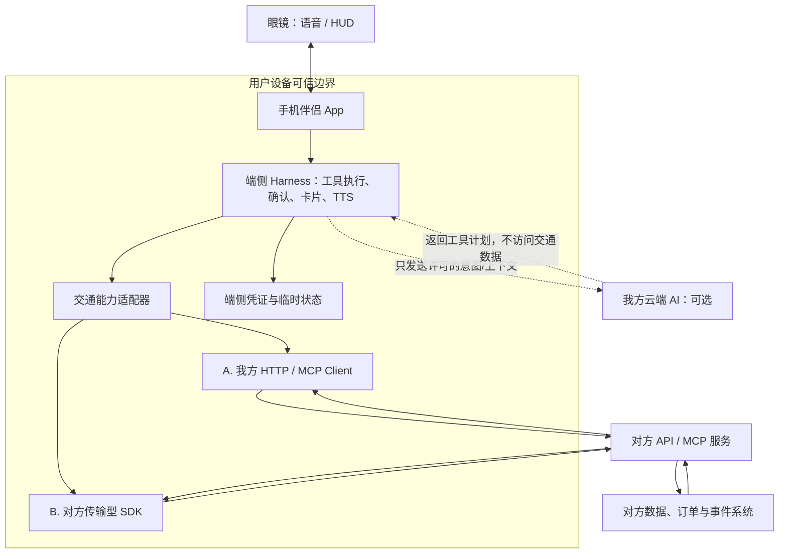

安全边界必须满足：第三方数据和凭证不经过我方云端。端侧如果需要大模型理解查询结果，只能使用获准的端侧模型、对方模型，或先经过双方认可的脱敏转换。云端大模型永远不接触 API key、refresh token、支付凭据或签名密钥。

这会截断常见的云端 function-calling 闭环。普通 agent 的流程是“云端模型决定调工具 → 工具结果回填云端模型 → 模型生成最终回答”；本项目的私人能力只能执行前半段：

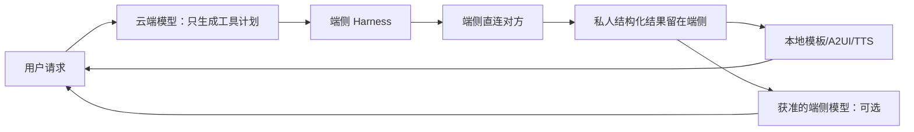

因此，方案一的端侧 SDK/HTTP client 不能只是一个网络库，端侧 Harness 还要承担结果解释、卡片生成、TTS、连续追问状态和交易确认。若这些工作也不希望由我方端侧处理，就应改用方案二，让对方 SDK 直接生成黑盒 UI/音频。

### 4.2 先把三个维度拆开

“MCP/API”“端侧/云端”“HTTP/SDK”回答的是三个不同问题：

| 维度 | 可选项 | 决定什么 |
|---|---|---|
| 业务协议 | OpenAPI、OpenAI 兼容接口、MCP | 工具怎么描述、参数和结果怎么组织 |
| 执行位置 | 我方云端、手机、独立眼镜 | 请求从哪里发出，数据经过哪些信任域 |
| 客户端封装 | 我方直接 HTTP、对方传输型 SDK、对方黑盒产品 SDK | 网络和生命周期由谁实现，数据是否暴露给我方 |

远程 MCP 并没有绕开 HTTP。其 Streamable HTTP 传输使用 HTTP POST/GET，并可用 SSE 承载服务端消息。[MCP Streamable HTTP](https://modelcontextprotocol.io/specification/2025-03-26/basic/transports) OpenAI 兼容接口本质也是 HTTPS JSON/SSE。协议名称不能证明请求来自端侧；对方要靠授权、设备绑定或 attestation 判断调用来源。

本项目已经固定第二个维度：私人能力只允许从设备执行。现在要比较的是第三个维度中的前两项。

### 4.3 方案一 A：我方端侧直连 HTTP

我方在手机或独立眼镜中实现 HTTP/OpenAPI/MCP client。对方公开 endpoint 和 schema；我方负责请求组装、网络调用、错误转换、凭证续期、重试、缓存和事件接入。

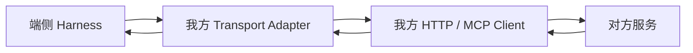

| 评估项 | 结果 |
|---|---|
| 产品控制 | 最高。我方拿到结构化数据后可以独立改卡片、TTS、排序和跨能力编排 |
| 协议透明度 | 最高。请求、错误码、耗时和重试全部可观测，容易抓包和自动化测试 |
| 多供应商适配 | 最好。可在我方统一 `TravelTransport` 接口下接多个 provider |
| Flutter 接入 | 简单。标准 HTTPS 可直接用 Dart client，或由原生网络层统一实现 |
| 对方改动灵活性 | 较低。endpoint、签名、证书 pin、字段或协议变化需要双方同步 |
| 鉴权责任 | 我方较重。OAuth 回调、token 存储、刷新、并发续期、吊销都要实现 |
| 后台消息 | 需要另建。HTTP 查询接口本身不会让休眠中的手机收到事件 |
| 数据合规 | 我方端侧代码可以读取数据，必须自行保证日志、缓存、崩溃和备份不留正文 |
| 供应链风险 | 较低。没有额外三方二进制进入 App，但我方承担更多代码和测试 |

直连方案不能把一个长期共享密钥硬编码进 APK/IPA。原生 App 是 public client，无法可靠保守内置 secret。推荐使用 Authorization Code + PKCE、短时用户 token，并在需要时结合设备 attestation 或发送者约束。对方若用“只有设备才能调用”作为硬规则，应提供可验证的设备注册和 token 绑定流程，而不是靠隐藏 URL 或混淆 API key。

直连更适合以下情况：

- 对方已经有稳定、结构化、版本化的端侧 API；
- 公开和私人接口使用标准 OAuth，不依赖私有密码学；
- 对方没有成熟的 Android/iOS/Flutter SDK；
- 我方需要同时接多个交通 provider，希望统一传输层；
- 推送可以另行采用标准系统推送或我方 OEM 消息通道。

### 4.4 方案一 B：对方传输型 SDK

对方 SDK 封装 endpoint、序列化、鉴权、设备绑定、网络请求和消息接收，但通过公开 API 把结构化结果返回给我方。它不负责最终 UI，也不把查询结果封装成黑盒 View。

期望的边界类似：

```text
TravelClient
  queryPublic(request)         -> PublicTravelResult
  queryMyTrips(request)        -> PersonalTripResult
  createBookingDraft(request)  -> BookingDraft
  confirmBooking(request)      -> BookingStatus
  tripEvents                   -> stream<TripEvent>
```

这仍是方案一。我方可以把 `PersonalTripResult` 转成自己的语音、A2UI 卡片和眼镜 HUD。只有当 SDK 不再返回结构化结果、改为返回 UI/音频时，它才属于方案二。

| 评估项 | 结果 |
|---|---|
| 产品控制 | 与直连基本相同，前提是 SDK 返回完整、稳定的结构化模型 |
| 对方安全控制 | 更强。对方可统一做设备注册、token 续期、签名、限流和协议升级 |
| 推送整合 | 更顺。SDK 可把系统推送、长连接和回源取数统一成 `tripEvents` |
| 协议透明度 | 较低。真实请求、重试、缓存和错误转换发生在 SDK 内 |
| Flutter 接入 | 依赖对方 bridge 质量；只有 Android/iOS SDK 时，我方要维护 Platform Channel |
| 稳定性影响 | SDK 的线程、网络、数据库、后台任务会直接影响我方 App 的崩溃、ANR、耗电和包体 |
| 升级节奏 | 受对方版本控制。紧急修复常常需要我方重新集成和发版 |
| 多供应商适配 | 较差。每家 SDK 的生命周期、模型和错误体系不同，适配层仍要由我方维护 |
| 数据合规 | SDK 可以统一关闭日志和缓存，但我方必须有审计证据，不能只相信口头承诺 |
| 安全隔离 | 同进程 SDK 不是强隔离。它能减少误用，但不能防止宿主 Hook、抓包或读取返回对象 |

传输型 SDK 必须满足以下准入条件：

- headless，查询与交易 API 不依赖 Activity、Fragment 或对方 UI；
- 返回结构化、版本化数据模型，不只返回自然语言或 View；
- 支持异步、取消、超时、幂等、并发和进程重建；
- 明确哪些数据会写磁盘、写多久，默认不记录请求/响应正文；
- 提供网络 trace ID、原始业务错误码和可控 debug 日志；
- 推送模块可选，且说明底层是 FCM、APNs、WebSocket 还是 OEM 通道；
- Android/iOS 行为一致，并提供官方 Flutter bridge、测试桩和离线 mock；
- 遵守语义化版本及兼容窗口，安全修复和停服有明确 SLA；
- SDK 的 UI 模块与 transport 模块拆包，避免我方为了网络能力被迫引入整套页面和资源。

### 4.5 推送通道单独选型

推送与查询接口不是一回事。查询由设备主动发起；推送要在 App 不活跃时把“有变化”送到设备。当前约束下，各方案的适用性如下：

| 通道 | 是否满足设备直连约束 | 后台可靠性 | 功耗 | 结论 |
|---|---|---|---|---|
| 对方 Webhook 携私人正文 → 我方阿里云 | 否。私人事件正文进入我方第三方云 | 服务端较高 | 端侧低 | 排除 |
| 对方 opaque Webhook → 我方推送中继 | 有条件。中继不能读取或兑换事件句柄，只负责路由 | 服务端较高 | 端侧低 | 若允许匿名/假名化元数据经过我方云，可作为实用方案 |
| 设备 WebSocket 直连对方 | 是，连接由设备主动建立 | 前台好；普通手机后台受系统限制 | 中到高 | 前台实时增强；不单独承担后台提醒 |
| FCM/APNs 发送完整行程 | 设备最终可收到，但正文经过 Google/Apple 推送云 | 较高 | 低 | 只有对方明确允许正文经过系统推送云时采用 |
| FCM/APNs 发送 opaque 唤醒信号，设备回源 | 是。系统推送不携带行程正文，数据由设备直连对方获取 | Android 较好；iOS 静默推送不保证送达 | 低 | 普通手机首选 |
| 对方 SDK 私有消息服务 | 取决于底层 | 取决于 FCM/APNs、长连接或 OEM 权限 | 取决于实现 | 不能只看名称，必须穿透评估底层通道 |
| 我方 OEM 系统消息通道 | 是，可由系统服务保持连接 | 在自有眼镜/系统 App 上可做高可靠 | 可控 | 独立眼镜或 OEM 特权设备优选 |

Android Doze 会推迟普通后台 CPU 和网络活动；Android 官方建议需要持续收消息的 App 优先使用 FCM，而不是每个 App 自己维持持久连接。[Android Doze 与 App Standby](https://developer.android.com/training/monitoring-device-state/doze-standby) FCM 高优先级用于时间敏感且会产生用户可见通知的消息，如果长期只做静默唤醒，系统可能降级其优先级。[FCM Android message priority](https://firebase.google.com/docs/cloud-messaging/android-message-priority)

iOS 的 background notification 是低优先级，系统不保证投递，并可能节流。因此“静默 push 唤醒后回源”不能作为 iOS 上百分之百可靠的实时承诺。[Apple：Pushing background updates to your app](https://developer.apple.com/documentation/usernotifications/pushing-background-updates-to-your-app)

还要明确谁持有宿主 App 的系统推送凭证。APNs device token 与设备和 App 绑定，发送方服务端需要相应 token 及 APNs 认证材料；FCM registration token 也与 Firebase project 的发送身份关联。[Apple：Registering your app with APNs](https://developer.apple.com/documentation/UserNotifications/registering-your-app-with-apns) [FCM server environment](https://firebase.google.com/docs/cloud-messaging/server-environment) 因此，“对方 SDK 支持推送”不能只交付端侧代码，还必须在以下两种服务端责任中选一项：

- 对方直接发 APNs/FCM：我方向对方授予严格限定到本 App 的推送凭证和设备 token，双方承担凭证共享风险；不得交付可发送我方其他 App 的团队级广域密钥；
- 我方 opaque 推送中继：对方只向中继提交不可兑换的事件句柄和设备路由标识，中继不调用对方数据接口，也不持有行程正文；系统推送凭证继续由我方掌握。

工程上更倾向第二种，因为宿主 App 的推送身份应由我方控制。它是否满足“阿里云不得接触对方用户数据”，取决于对方是否认可 opaque 事件句柄和路由标识不是可读业务数据。若不认可，只能采用对方直发或 OEM 系统通道。

推荐链路：

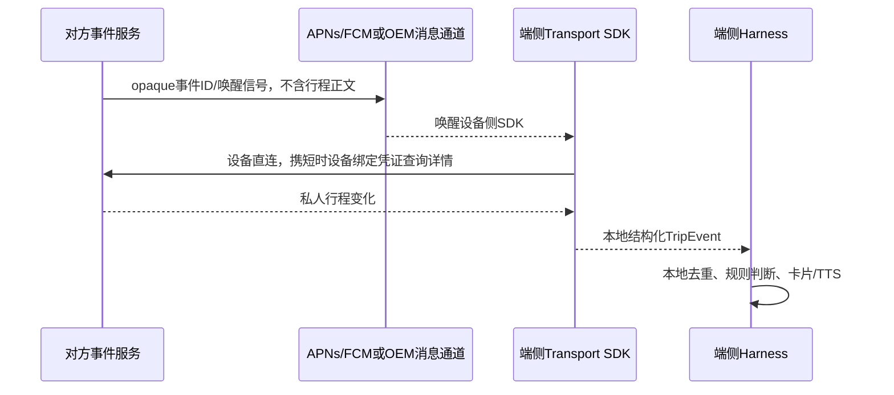

为处理静默推送未送达，产品必须有补偿路径：用户打开 App 或卡片时主动同步；长时间未同步时显示“状态待刷新”；极重要事件可由对方发送不含行程正文的可见通知“行程有更新，点击查看”。如果连 Google/Apple 的 opaque 推送也不允许，只能使用 OEM 系统通道或设备长连接，并接受对应的平台和功耗成本。

### 4.6 方案一内部选型建议

当前更倾向**手机端传输型 SDK + opaque 系统推送唤醒 + 设备直连回源**。系统推送的发送端优先采用我方 opaque 中继；合规不接受时，改由对方直发。

| 决策重点 | 端侧直连 HTTP | 对方传输型 SDK | 倾向 |
|---|---|---|---|
| 我方产品控制 | 完整 | SDK 返回结构化数据时同样完整 | 持平 |
| 对方确认请求来自真设备 | 需要额外开放 attestation/设备注册协议 | 可由对方统一封装 | SDK |
| 凭证和签名演进 | 双方协议联动 | 对方可在 SDK 内收口 | SDK |
| 后台推送与回源 | 我方另建消息模块 | 可作为 SDK 的 `tripEvents` 一并交付 | SDK |
| 网络可观测与故障定位 | 最好 | 依赖 SDK trace 和错误透出 | 直连 |
| 多 provider 与跨平台 | 我方统一最容易 | 容易被各家 SDK 和平台版本割裂 | 直连 |
| 包体、稳定性、供应链 | 我方可控 | 多一个高权限二进制依赖 | 直连 |
| 对方合规接受度 | 较低，需要相信我方正确实现 | 较高，对方能统一约束正常调用路径 | SDK |

决定性约束是对方要求设备来源可控，同时主动提醒又是正式产品能力。这让传输型 SDK 的收益超过了直连在透明度和轻量化上的优势。

原因很具体：

- 对方最在意请求来源和数据边界。SDK 便于其统一做设备注册、短时凭证、attestation 和协议升级；
- 推送是整个方案中最难靠一个裸 HTTP API解决的部分。SDK 可以向我方只暴露本地 `TripEvent`，把 FCM/APNs、WebSocket、重连和回源细节收在内部；
- 我方仍拿到结构化数据，能保留语音、AIGUI、眼镜 HUD 和跨能力编排的产品控制权；
- 以手机为主执行端，比眼镜更适合登录、凭证安全存储、系统推送和网络保活。眼镜负责语音与显示；只有具备独立网络和系统权限的眼镜才考虑直接运行同一 SDK。

这个倾向有明确前提：对方交付的是“传输 SDK”，不是“UI SDK”；SDK 满足 4.4 的准入条件，并允许我方完成安全审查和性能验收。出现以下任一情况，应退回我方端侧直连 HTTP：

- SDK 只支持单一平台，无法覆盖目标 Android/iOS/眼镜系统；
- SDK 强绑对方 Activity/View，不能作为无头能力调用；
- 不提供结构化数据、原始错误码、取消/超时或测试桩；
- 隐式缓存私人数据、上传日志，或拒绝说明底层推送和网络行为；
- 发版频繁破坏兼容，且没有 LTS、灰度和紧急修复机制。

直连 HTTP 不是技术上的次等方案。它是 SDK 质量或平台覆盖不达标时更可控的选择。最终合同中应保留 schema 和行为规范，避免 SDK 成为唯一、不可替换的事实标准。

### 4.7 MCP 与 REST/OpenAPI 的实际差异

| 对比项 | REST/OpenAPI | MCP | 对产品能力的影响 |
|---|---|---|---|
| 接口发现 | 通过文档/OpenAPI schema | 可动态列出工具与 schema | MCP 更便于 agent 宿主发现能力 |
| 调用模型 | HTTP 资源/动作接口 | `tools/list` + `tools/call` | 只是封装方式不同 |
| 流式 | SSE/WebSocket 等成熟 | 取决于服务实现和 MCP 传输能力 | 影响首字延迟，不改变业务上限 |
| 授权 | OAuth/API key 等 | 远程 MCP 同样需要 OAuth | MCP 不免除授权设计 |
| 事件推送 | 设备订阅 + WebSocket/系统推送 | 不能默认认为已有 | 主动提醒仍需单独事件契约；私人 Webhook 不进入我方云端 |
| 交易安全 | 业务自行设计 | 业务自行设计 | 两者都需要确认、幂等和审计 |

如果对方只通过 MCP 暴露一个 `chat_completions(query)` 工具，内部再由对方模型决定查什么，我方虽然能快速接入，但控制力有限：

- 无法稳定区分“查一下”与“执行订票”的权限；
- 很难在交易前展示确定的价格、退改规则和乘客信息；
- 文本结果难以可靠生成常驻卡片；
- 出错时只能得到自然语言，无法做自动重试和精确提示；
- 我方和对方各有一层模型，意图可能被二次解释。

因此，MCP 可以作为传输和注册协议，但交易型产品仍应暴露细粒度、结构化工具。

### 4.8 推荐的最小能力集合

| 能力 | 类型 | 关键输入 | 关键输出 |
|---|---|---|---|
| `search_transport` | 公开读 | 出发地、目的地、日期、偏好 | 稳定的候选 ID、时间、票价、余票、来源时间 |
| `get_transport_status` | 公开读 | 航班号/车次、日期 | 实时状态、站台/登机口、更新时间 |
| `get_user_trips` | 私人读 | 授权上下文、时间范围 | 行程 ID、必要摘要、状态 |
| `get_order_detail` | 私人读 | 订单或行程 ID | 乘客摘要、金额、退改规则、状态 |
| `create_booking_draft` | 私人写入前置 | 候选 ID、乘客引用、席别 | 草稿 ID、锁定价格、失效时间、确认摘要 |
| `confirm_booking` | 高风险写 | 草稿 ID、一次性确认凭证、幂等键 | 订单状态、支付/出票下一步 |
| `quote_refund` | 私人写入前置 | 订单 ID、乘客引用 | 可退金额、费用、后果、报价失效时间 |
| `confirm_refund` | 高风险写 | 报价 ID、一次性确认凭证、幂等键 | 退票结果和审计 ID |
| `subscribe_trip_events` | 订阅 | 行程引用、事件类型、设备通道句柄 | 订阅 ID、有效期 |
| `unsubscribe_trip_events` | 取消订阅 | 订阅 ID | 取消结果 |

“查询”和“执行”必须是不同工具。“报价”和“确认”也必须分开。模型可以发起前置步骤，但最终写操作只接受端侧确认闸或对方 SDK 在用户明确确认后签发的一次性凭证。

### 4.9 用户授权与凭证放置

对方登录页应通过系统浏览器或系统级浏览器页打开。我方不收集账号密码，不在自有 WebView 中注入脚本。原生应用授权推荐使用 Authorization Code + PKCE；RFC 8252 明确要求原生应用通过外部 user-agent 授权，并要求 public native client 使用 PKCE。[RFC 8252：OAuth 2.0 for Native Apps](https://www.rfc-editor.org/info/rfc8252/)

不建议把长期有效的“万能 key”作为交付物。应区分以下凭证：

| 凭证 | 用途 | 建议 |
|---|---|---|
| 应用身份 | 标识我方渠道和调用配额 | 使用公开 client ID、设备注册和 attestation；不在 App 内硬编码可复用 secret |
| 用户 access token | 访问特定用户资源 | 短时有效、限定 scope 和 audience |
| refresh token | 延续用户授权 | 优先留在对方 token broker；若允许我方保管，必须单独加密和审计 |
| 一次性确认凭证 | 放行某次订票或退票 | 绑定用户、草稿、金额、动作和短失效期，不可重放 |
| opaque subject/session handle | 关联用户授权但不直接暴露账号 | 可作为双方折中，但必须说明是否仍属于个人数据 |

推荐形态是“对方 token broker + 端侧短时凭证”：对方保存长期授权，手机 Keystore/iOS Keychain 只保管短时、细粒度、可撤销的 access token 或 opaque handle；端侧直接调用对方。我方云端不设 token vault，也不代理请求。

如果对方连短时 access token 或 opaque handle 都不允许暴露给我方端侧代码，可以把凭证封装在传输型 SDK 内。若对方同时不允许 SDK 向我方返回结构化数据，则该接入已经变成方案二的黑盒产品 SDK。

MCP 当前远程授权规范要求采用 OAuth 2.1 相关安全措施，并通过受保护资源元数据发现授权服务。[MCP Authorization](https://modelcontextprotocol.io/specification/2025-11-25/basic/authorization) OAuth 安全最佳实践还要求 PKCE、防止 token 重放，并限制 access token 的权限和适用资源。[RFC 9700：OAuth 2.0 Security Best Current Practice](https://www.rfc-editor.org/info/rfc9700/) audience-restricted token 可以防止为一个资源签发的 token 被拿去调用另一个资源。[RFC 8707：Resource Indicators for OAuth 2.0](https://datatracker.ietf.org/doc/html/rfc8707)

### 4.10 公开查询数据流

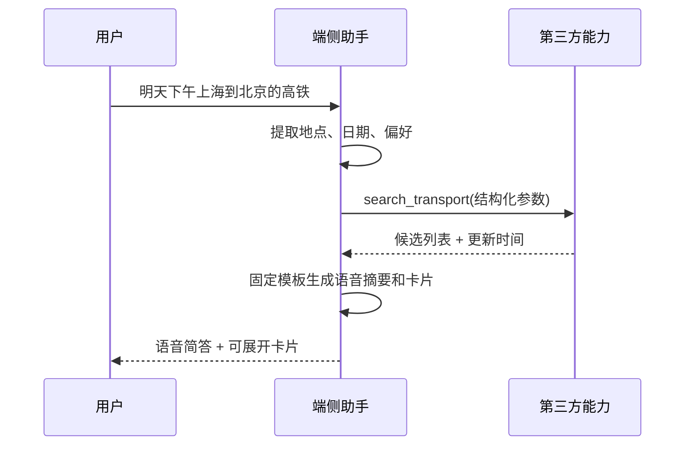

公开数据也应带 `source_timestamp`、数据有效期和稳定候选 ID。没有这些字段，助手无法说明数据新鲜度，也无法把用户选中的候选安全地传到后续订票步骤。

### 4.11 私人查询数据流

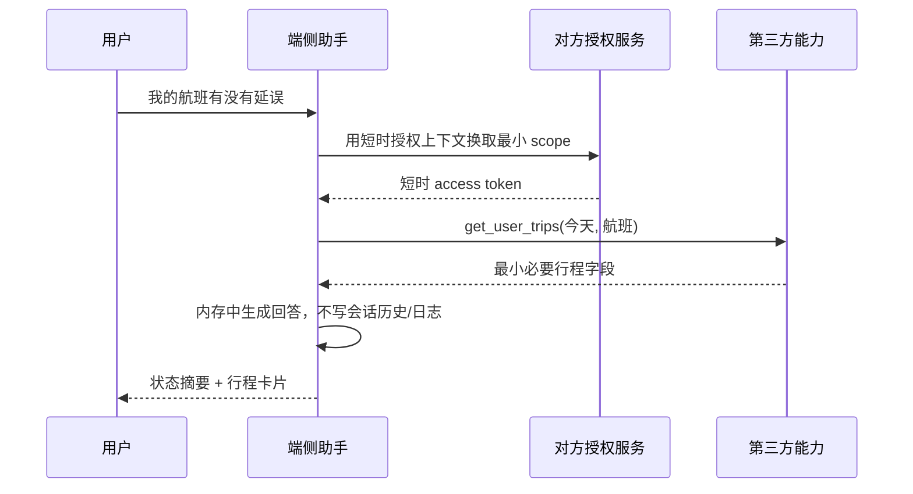

如果私人数据不能持久化，我方需要为这类轮次启用“无痕处理通道”：

- 不写对话历史、记忆、向量库和评测样本；
- 日志只保留 request ID、接口名、耗时、错误码，不保留 query、响应体或 token；
- 端侧 APM、SDK debug log、崩溃平台和系统备份同时关闭正文采集；
- 私人结果不回传我方云端模型；需要语义处理时使用获准的端侧模型或对方能力；
- 响应完成后释放内存对象，临时文件和重试队列不得保留业务正文。

这里有一个经常被忽略的事实：把私人行程放进云端大模型上下文，本身就是向另一个处理方传输和处理数据。即使我方数据库没有落表，也不能直接宣称“数据没有被存储或共享”。

### 4.12 订票与退票数据流

高风险写操作必须使用“两阶段交易”，不能让大模型一次工具调用直接完成。

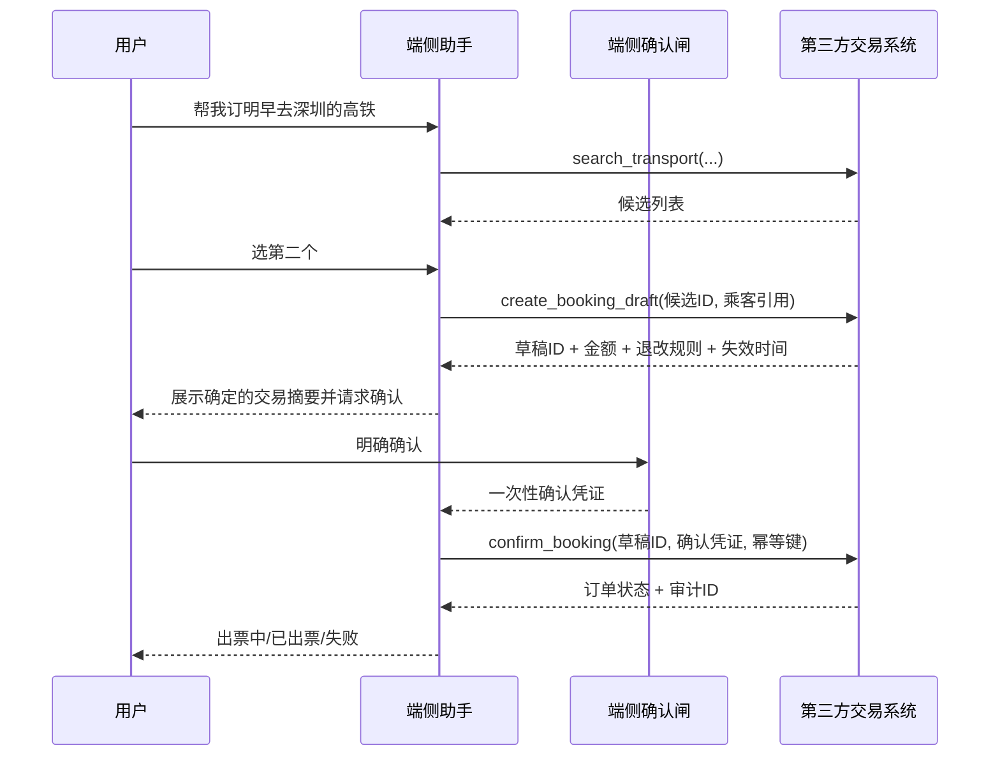

交易接口需满足以下硬条件：

- 每个写请求都带 `idempotency_key`，网络重试不会重复下单或重复退票；
- 确认页展示的价格、乘客、车次/航班、日期和退改后果与最终提交完全绑定；
- 草稿和报价有明确失效时间，过期必须重新报价和确认；
- `accepted`、`processing`、`succeeded`、`failed` 状态分开，超时不能被当作失败后直接重试；
- 返回可供双方定位的审计 ID，但日志中不写完整乘客和订单数据；
- 撤销授权、退出账号或设备丢失后，所有未使用确认凭证立即失效。

### 4.13 常驻卡片

方案一可以生成我方原生卡片，但数据合规会直接决定卡片形态。

| 合规许可 | 可实现形态 | 限制 |
|---|---|---|
| 允许保存必要行程摘要 | 卡片可离线显示、重启恢复、后台更新 | 需规定字段、保留期和删除机制 |
| 只允许保存 opaque `card_id` | 卡片显示时向对方即时取数 | 弱网时只能显示骨架/过期提示，无法真正离线 |
| 不允许我方保存任何标识或内容 | 仅当前会话临时卡片 | 无法跨进程、跨重启常驻 |
| 只允许对方持有和渲染 | 使用对方 SDK 卡片或 Remote View | 样式、刷新和兼容性由对方控制，已接近方案二 |

必须注意：把“明天 08:12 上海虹桥出发”保存为卡片摘要，仍然是在保存私人行程。它不是因为经过了格式转换就自动脱敏。

### 4.14 主动推送

主动推送需要对方提供事件源和设备投递能力。涉及私人数据时，不使用“对方 Webhook → 我方阿里云 → 手机”链路。仅靠设备定时轮询会增加功耗、延迟和调用配额，也无法保证及时提醒。

推荐事件链路：

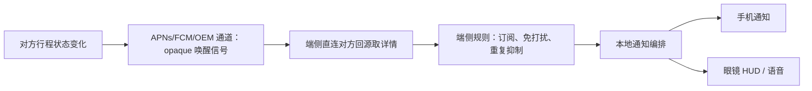

系统推送载荷只放不可读、短时、不可重放的事件句柄。设备回源后的本地事件至少包括：事件 ID、事件类型、行程 opaque ID、发生时间、数据版本和有效期。对方按至少一次语义投递，我方端侧按事件 ID 去重。平台可靠性和补偿策略按 4.5 执行。

### 4.15 方案一能做出的产品

- 语音直接回答公开及私人交通问题；
- 统一的手机卡片、眼镜 HUD 和 TTS 反馈；
- 把交通与天气、日历、地图等我方能力组合；
- AI 收集订票条件，用户确认后完成订票和退票；
- 常驻行程卡片和跨设备同步；
- 根据对方事件做延误、检票口、出发倒计时等主动提醒；
- 用户定义有限自动化规则，如“延误超过 30 分钟再提醒”。

上述能力并非拿到一个 key 就自然成立。它们分别依赖结构化接口、细粒度授权、交易确认、事件订阅及明确的数据处理许可。

### 4.16 方案一的主要利弊

优势：

- 产品体验由我方统一，能真正融入语音助手、手机和眼镜；
- 可做跨能力编排和 AIGUI，而不是简单跳转；
- 公共查询、私人查询、交易和事件可以按权限逐步开放；
- 接口适配层可隔离 MCP/REST 差异，后续替换传输方式不重做产品层。

代价与风险：

- 我方成为数据处理链路的一部分，双方必须明确责任和审计证据；
- 凭证、日志、模型上下文和交易确认都需要专门建设；
- 对方接口的 schema、SLA、事件完整性直接影响我方体验；
- 工具返回内容也可能包含提示注入或异常文本，不能原样提升为系统指令；
- 接口一旦只返回自然语言，我方卡片和交易可靠性会明显下降。

---

## 五、方案二：端侧 SDK 黑盒能力

### 5.1 方案定义

第三方提供的不只是一个页面，而是一组不透明的产品能力。账号登录、数据访问、业务判断、查询结果、订退票、卡片刷新和主动提醒都由对方 SDK 及其云端完成。我方把用户意图交给 SDK，并承载 SDK 返回的 UI、音频或通知，但不读取其中的私人业务数据。

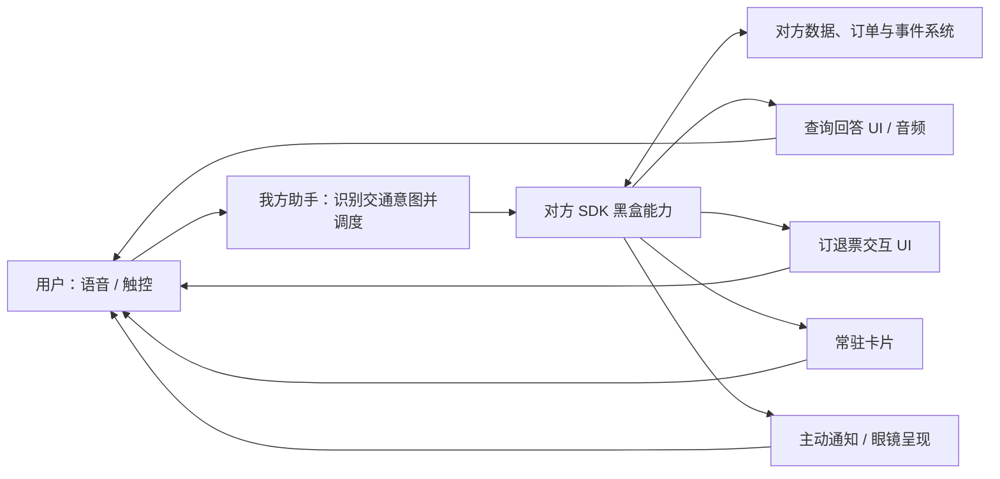

对用户来说，它仍然可以是一套完整的行程助手；对工程边界来说，这是一个“对方实现垂直产品、我方提供宿主”的模式。我方能决定何时调用、放在哪里，但不能自行解释或重排黑盒里的私人内容。

### 5.2 SDK 不是一个接口，而是四种必须分别交付的呈现能力

双方应按产品场景定义 SDK contract，不能用“提供一个 SDK”笼统代替：

| SDK 能力面 | 对方需要实现什么 | 我方如何接入 |
|---|---|---|
| 查询回答面 | 接收“看下我的行程”等意图，在 SDK 内鉴权、取数并生成结果 UI；需要纯语音时同时生成 TTS/音频 | 把黑盒 View/Surface/PlatformView 挂到当前回答位置，或播放对方生成的音频 |
| 交易交互面 | 选票、乘客、价格确认、支付、出票和退票全流程 | 启动嵌入式流程，接收不含业务正文的完成/取消/失败状态 |
| 常驻卡片面 | 卡片渲染、数据刷新、过期、登录失效、交互和恢复 | 在手机或眼镜的约定区域长期承载组件，转发生命周期 |
| 主动提醒面 | 对方云端监听行程变化，SDK 接收事件、过滤并生成通知/卡片/音频 | 提供系统通知权限、眼镜通道和展示时机，承载最终内容 |

还需要一个宿主控制契约：初始化、登录状态、前后台生命周期、主题和尺寸、错误状态、销毁、版本协商、trace ID。宿主控制信息不等于私人业务数据，可以在双方确认后开放给我方。

### 5.3 语音直接回答私人行程

SDK 方案可以完成这项功能，调用链如下：

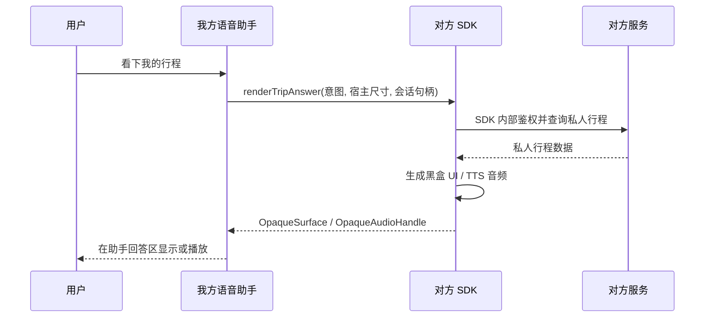

这就是“语音助手直接回答私人行程”：入口属于我方助手，回答内容由对方生成。我方知道本次调用是“查看行程”，但不知道具体车次、时间、乘客和订单内容。

连续追问也可以做，但需要把同一垂直场景继续路由给 SDK。例如用户接着问“有没有延误”，我方把原始追问和 opaque session handle 交给 SDK，由对方维护私人会话上下文并返回新的黑盒回答。我方大模型不能拿上一次私人答案继续推理。

若要回答“结合天气，我应该几点出门”这类跨域问题，有两种实现：

- 方案一由我方读取交通与天气数据后编排；
- SDK 方案由我方把允许共享的天气、位置等公开上下文传给对方，具体推理由对方在 SDK/云端实现，再返回黑盒答案。

所以这类产品不是做不了，而是每增加一种跨域逻辑，都需要双方定义输入边界，并由对方增加实现。我方无法只改提示词就独立上线。

### 5.4 订票和退票

SDK 可以封装完整交易闭环。AI 先识别“订票”或“退票”，然后启动对方的交易交互面。候选选择、价格、乘客、退改规则、确认、支付、验证码和结果全部由 SDK 展示和执行。

如果产品要求全程只通过眼镜和语音完成，对方还需在 SDK 中实现适合无屏/小屏环境的对话、确认摘要、TTS 和输入组件，而不是复用手机全屏页。高风险确认仍应由对方交易状态机控制，不能因为入口是 AI 就跳过。

SDK 可以向我方返回 `succeeded/cancelled/processing/failed` 和 opaque trace ID，供我方结束对话和定位故障。订单号、乘客、价格等是否允许随回调返回，由数据协议另行决定；不返回这些字段也不妨碍 SDK 自己完成交易。

### 5.5 常驻卡片

常驻卡片由双方先确定产品规格，再由对方在 SDK 内实现。SDK 自己持有数据、刷新状态并渲染，我方只提供承载位置与生命周期。

可选的工程形态包括：

- 同进程 View/Fragment，Flutter 侧通过 PlatformView 承载；
- 对方进程渲染的 Surface/Remote UI，我方只嵌入最终呈现面；
- 面向眼镜的专用渲染组件，由 SDK 直接向眼镜显示通道提交内容；
- 对方 SDK 管理的系统 Widget/通知样式。

产品规格至少要写清：

- 手机 App 内、桌面、锁屏和眼镜 HUD 分别显示什么；
- 卡片尺寸、主题、字体、触控、焦点、无障碍和隐私遮挡；
- 前后台刷新、弱网、离线占位、登录失效和数据过期；
- 截屏、最近任务缩略图、通知预览和多用户切换；
- 点击卡片后的详情和交易流如何继续；
- SDK 升级时如何兼容已经常驻的组件。

这种卡片从产品归属上可以展示在“我方常驻区域”，从实现归属上仍是“对方卡片组件”。这两个说法并不矛盾。

### 5.6 主动提醒

主动提醒同样可以在 SDK 方案中完成。对方云端最了解行程变化，由它生成事件；SDK 在端侧接收、去重、判断登录状态，并生成通知、卡片更新或眼镜提示。我方负责提供系统权限和最终展示通道。

若对方也不允许行程正文经过 APNs/FCM，黑盒产品 SDK 应采用与 4.5 相同的“opaque 唤醒 + SDK 端侧回源”链路，只是回源后的数据仍留在 SDK 内，由 SDK 直接生成 UI/音频，不再转成我方 `TripEvent`。

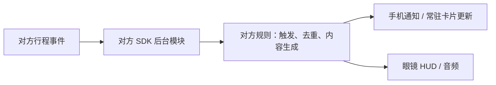

提醒策略也可以做得很丰富，但应明确由谁修改：

- 固定规则，如延误、值机、检票口变化，由对方实现；
- 用户自定义规则，可以由我方 AI 理解自然语言，再把规则请求交给 SDK，由对方展示确认并保存执行；
- 跨多个能力的统一免打扰和优先级，可以由我方把允许共享的宿主状态传给 SDK，也可以由对方暴露不含业务正文的事件级别；
- 如果任何元数据都不允许离开 SDK，则所有提醒决策都由对方完成，我方只提供投递通道。

### 5.7 “黑盒不可见”需要区分合同边界与技术隔离

普通 `.aar`/framework SDK 与宿主 App 在同一进程运行。“不提供数据接口、只返回 UI”可以形成清晰的 API 和组织边界，但不能对抗恶意宿主：宿主理论上仍可能 Hook、遍历 View、截屏或读取进程内存。

因此双方要选择需要哪一级隔离：

| 隔离级别 | 实现 | 能保证什么 |
|---|---|---|
| L1：接口隔离 | 同进程 SDK，只暴露黑盒 UI，不返回数据对象 | 我方正常业务代码不接触数据；依赖合同、代码审查和审计约束 |
| L2：进程隔离 | 对方独立进程/服务渲染，IPC 只传控制参数和 Surface 句柄 | 降低误用和普通代码访问风险，但仍需处理截屏、调试和系统级攻击 |
| L3：应用/系统隔离 | 对方独立 App、受信系统服务或安全显示通道 | 数据与存储归属最清晰，集成和跨平台成本最高 |

还有一个必须由合规确认的问题：SDK 即使由对方开发，只要它把数据缓存在我方 App 沙箱或运行在我方售出的设备上，是否仍算“存储在我方端侧”。技术团队不能自行把“对方代码写的文件”定义成“不是我方端侧数据”。

### 5.8 SDK 的工程约束

对方至少需要交付并承诺：

- 查询回答、交易、常驻卡片、主动提醒四个能力面的 API 与生命周期；
- Android/iOS 支持版本、CPU ABI、包体积、最低设备配置；
- Flutter 接入方式，最好提供原生 SDK 加官方 Flutter bridge；
- Activity/View/Surface 生命周期、进程重建、账号切换和授权失效行为；
- 意图入参、宿主上下文、错误码、opaque session 和受限回调 schema；
- 网络、定位、通知、相机、麦克风等权限由谁申请、为何申请；
- SDK 依赖树、开源许可、漏洞修复时限和版本支持周期；
- 崩溃、ANR、耗电、启动耗时、内存和后台保活指标；
- 混淆、签名校验、截屏防护、调试策略和安全事件响应机制；
- 测试环境、模拟账号、自动化测试支持、灰度和回滚能力。

我方不得用 Accessibility 抓屏、OCR、WebView DOM 注入、Hook 或截图识别提取黑盒数据。这既破坏方案二的数据边界，也会让产品建立在不可维护的实现上。

### 5.9 方案二能做出的产品

只要对方按双方确认的产品规格完整实现 SDK，方案二可以交付：

- 语音触发的公开和私人行程回答，回答由对方黑盒 UI/音频呈现；
- 我方 App 或眼镜区域内的常驻行程卡片；
- 对方事件驱动的手机通知、卡片更新、眼镜 HUD 和语音提醒；
- 对方 UI 内完成的订票、出票、支付和退票；
- 有限的连续追问、用户规则和跨域场景，具体逻辑由对方实现。

它的能力上限不是“只能跳页面”，而是“只能运行对方已经做进 SDK 的产品”。方案一新增场景通常由我方组合接口完成；方案二新增场景通常要重新经过双方产品定义、对方开发和 SDK 发版。

### 5.10 方案二的主要利弊

优势：

- 私人数据、账号、业务判断和交易链路由对方封闭管理；
- 同样能提供查询回答、卡片、提醒和交易等完整表层体验；
- 我方不需要建设私人数据模型、缓存和大部分交易状态机；
- 对方可以复用既有数据服务、风控、支付和提醒能力；
- 产品责任清楚：黑盒内的正确性由对方负责，宿主和设备通道由我方负责。

代价与风险：

- 产品形态、交互细节和提醒规则必须与对方共同定义，并由对方开发；
- 我方不能基于黑盒内容自由重排 UI、调整话术或临时组合新能力；
- 对方 SDK 的崩溃、包体、权限、升级和兼容风险进入我方客户端；
- 端内跨能力体验需要逐项设计输入边界，不能由我方通用 agent 自由组合；
- 我方难以观测业务内部错误，客服和故障定位依赖对方 trace；
- 同进程 SDK 只能形成合同/API 黑盒，若要求强技术隔离还需增加进程或应用级方案。

---

## 六、两种方案的产品能力矩阵

两种方案都能覆盖核心场景。矩阵重点比较“谁实现”，而不是简单打勾或打叉。

| 产品能力 | 方案一：开放接口 | 方案二：端侧 SDK 黑盒能力 | 核心差别 |
|---|---|---|---|
| 公开交通语音回答 | 我方根据结构化数据生成 UI/TTS | 对方 SDK 生成黑盒 UI/TTS | 呈现逻辑归属不同 |
| 私人行程语音回答 | 我方临时处理数据后生成 | 对方 SDK 内取数并生成黑盒回答 | 我方是否看见回答语义 |
| 连续追问 | 我方模型维护完整上下文 | 对方用 opaque session 维护私人子会话 | 谁掌握私人会话上下文 |
| 手机回答卡片 | 我方原生模板渲染 | 对方组件嵌入我方回答区 | 组件实现和发版归属不同 |
| 眼镜 HUD | 我方把结构化数据适配为眼镜 UI | 对方 SDK 提供眼镜专用呈现面 | 对方是否交付眼镜端组件 |
| 跨天气/地图/日历推理 | 我方可按权限自由组合 | 双方定义允许输入，由对方增加逻辑 | SDK 方案也能做，但不是我方独立编排 |
| AI 辅助选票 | 我方 AI 排序和解释 | 对方 SDK/模型排序并生成结果面 | 算法和解释权归属不同 |
| 订票/退票闭环 | 我方编排，对方交易接口执行 | 对方 SDK 内完成整个流程 | 交易 UI 和状态机归属不同 |
| 交易确认 | 我方确认页 + 对方执行接口 | 对方确认组件 | 最终交易责任都必须明确 |
| 常驻行程卡片 | 我方依据数据/事件渲染和刷新 | 对方 SDK 组件渲染和刷新 | 谁持有卡片状态 |
| 主动提醒 | 对方向我方发事件，我方决定和呈现 | 对方生成提醒，我方提供投递通道 | 谁看见事件正文并制定规则 |
| 用户自定义规则 | 我方 AI 编译，我方规则引擎执行 | 我方识别后交给 SDK，由对方确认和执行 | 规则存储与执行位置不同 |
| 数据不向我方业务代码暴露 | 较难，必须经过我方能力层 | 可通过黑盒 API 实现 | 强隔离仍需进程/应用级设计 |
| 产品样式一致性 | 我方可直接控制 | 双方定规范，对方实现 | SDK 方案受协作和发版周期约束 |
| 新场景上线 | 我方可组合已有接口 | 通常需要对方修改 SDK | 演进速度和组织依赖不同 |
| 主要开发投入 | 我方 Harness、UI、规则和合规建设 | 对方 SDK 产品化，我方做宿主接入 | 成本从我方转移到对方 |

---

## 七、数据与合规责任矩阵

此表不是法律结论，而是双方安全和法务必须逐项确认的技术事实。任何一格留空，研发都无法证明“不存储”。

| 数据对象 | 方案一推荐边界 | 方案二推荐边界 | 必须确认的问题 |
|---|---|---|---|
| 对方账号密码 | 永不进入我方 | 永不进入我方 | 登录页是否由外部浏览器/对方组件控制 |
| 应用身份 | 端侧公开 client ID + 设备注册/attestation，不硬编码共享 secret | 由 SDK 管理设备注册，不硬编码可复用密钥 | 设备换绑、泄露后的轮换和吊销机制 |
| 用户 access token | 仅端侧短时保存，最小 scope、设备绑定、限定 audience | 对方 SDK 内 | 端侧存储位置、有效期和换机策略 |
| refresh token | 由对方 broker 保存 | 对方保存 | 撤销时效、离线和续期失败行为 |
| 原始私人行程 | 仅在端侧调用内存中处理，默认不落盘 | 仅对方 SDK 内部使用，不通过 SDK API 暴露 | 同进程 SDK 是否满足隔离要求，是否需要独立进程 |
| 行程摘要/卡片 | 按白名单字段和 TTL 存储，或只存 card ID | 对方组件持有数据和渲染状态 | SDK 在我方 App 沙箱内的缓存算谁的存储 |
| 订单与支付状态 | 只保存最小状态/审计 ID，或即时查询 | 对方 SDK | 售后与争议处理需要保留什么 |
| 对话历史 | 私人轮次默认不保存正文 | 我方只保存入口意图 | 用户主动查看历史是否构成存储例外 |
| 模型上下文 | 不进入我方云端模型；只允许获准的端侧/对方模型 | 我方模型不接触；对方若使用模型则由对方负责 | 对方或端侧模型的保留策略 |
| 日志/APM/崩溃 | 禁止采集 token 和正文 | SDK 自己负责；我方仅收技术错误码 | 第三方 SDK 崩溃日志是否含业务字段 |
| 推送正文 | APNs/FCM 只带 opaque 唤醒句柄，设备回源取正文 | 对方负责 | 锁屏可见性、系统通知历史和眼镜旁观风险 |
| 删除与撤销 | 用户登出即撤销，按 SLA 清理所有允许的副本 | SDK 清理自身数据 | 备份、离线设备和失败重试队列如何处理 |

需要特别写清三件事：

1. “不存储用户数据”是否包含 access token、union ID、订单 ID、行程 ID和事件码；
2. 私人数据不得进入我方云端；在端侧是否允许进入我方业务代码、同进程 SDK、独立进程和端侧模型；
3. 为了卡片、通知、审计和售后，哪些最小字段可以作为明确例外保留多久。

---

## 八、主要风险与控制措施

### 8.1 方案一

| 风险 | 后果 | 必须采取的控制 |
|---|---|---|
| 万能 key 或 token 泄露 | 可批量读取/操作用户数据 | 短时 token、scope、audience、轮换、吊销、发送者约束 |
| 我方云端复用端侧凭证调用 | 破坏“只能设备访问”的边界 | token 绑定设备/attestation；对方服务拒绝非设备环境 |
| 私人数据进入日志或模型记录 | 违反双方数据约定 | 无痕通道、字段级日志策略、模型出口策略、定期扫描 |
| 模型误调用写工具 | 错订、重复订、误退 | 读写工具分离、两阶段交易、用户确认、幂等键 |
| 价格或余票过期 | 用户确认内容与执行结果不同 | 报价版本和失效时间绑定，变化后重新确认 |
| MCP/接口返回恶意文本 | 提示注入或越权诱导 | 工具输出按不可信数据处理；schema 校验；不执行返回文本中的指令 |
| 事件重复或乱序 | 重复提醒、显示旧状态 | 事件 ID 去重、版本号、时间戳、查询回源 |
| 静默推送延迟或丢失 | 卡片和提醒不是实时状态 | 打开/前台同步、可见泛化通知、WebSocket/OEM 通道增强 |
| 传输型 SDK 隐式缓存或吞错误 | 合规不可证、故障无法定位 | SDK 数据清单、trace ID、原始错误码、测试桩和安全评审 |
| 对方接口不可用 | 助手失效 | 明确超时、降级、熔断、SLA 和状态页 |

MCP 官方安全指南明确禁止简单 token passthrough，因为它会破坏 token audience、限流和验证等安全控制。[MCP Security Best Practices](https://modelcontextprotocol.io/docs/tutorials/security/security_best_practices)

### 8.2 方案二

| 风险 | 后果 | 必须采取的控制 |
|---|---|---|
| SDK 崩溃或 ANR | 直接拖累我方 App 稳定性 | 进程/页面隔离策略、性能门槛、灰度和回滚 |
| 依赖冲突、ABI 不兼容 | 无法构建或部分设备不可用 | 依赖清单、兼容矩阵、CI 集成样例 |
| 权限过度申请 | 用户信任和审核风险 | 权限逐项说明、按需申请、拒绝后降级 |
| 只交付手机页面，未交付回答/卡片/提醒面 | 产品无法达到双方约定形态 | 先冻结四类 SDK 能力面及验收标准，再开始开发 |
| SDK UI 与眼镜不匹配 | 用户仍需掏手机 | 对方按共同 PRD 交付眼镜专用呈现面 |
| 业务错误不可观测 | 我方客服无法定位 | 返回 opaque trace ID 和技术错误码 |
| 版本升级受制于对方 | 修复周期不可控 | LTS 版本、兼容窗口、紧急安全升级 SLA |
| SDK 内部数据行为不透明 | 我方无法证明合规 | SDK 数据清单、网络域名清单、安全评估和审计权 |
| 同进程 SDK 被误认为强安全黑盒 | 合规保证强于技术事实 | 明确采用 L1/L2/L3 哪级隔离，不用接口封装冒充安全隔离 |

---

## 九、我方建议的合作选择

### 9.1 方案一的具体选择

如果我方需要独立决定产品形态、快速组合天气/地图/日历等能力，并通过修改我方 Prompt、规则和 UI 持续迭代，应选择方案一。结合“只能设备访问”的约束，优先采用手机端传输型 SDK；SDK 不合格或平台覆盖不足时，退回手机端直连 HTTP。共同要求如下：

- REST/OpenAPI 或 MCP 均可，我方通过统一适配层接入；
- 对方接口只能由端侧 transport adapter/SDK 调用，我方云端不持有 token、不做代理；
- 公开查询、私人查询、交易、事件分成独立工具和 scope；
- 对方保管 refresh token，端侧使用短时、设备绑定、限定 audience 的令牌；
- 对方只返回完成当前交互所需的最小结构化字段；
- 私人轮次走无痕处理通道，不进入记忆、普通会话历史、日志和训练数据；
- 订票/退票使用草稿/报价 + 明确确认 + 幂等执行；
- 常驻卡片优先只保存 opaque ID，展示时即时拉取；若要离线或重启恢复，双方另行批准摘要字段和 TTL；
- 主动提醒优先使用 opaque 系统推送唤醒，端侧直连回源；WebSocket 只做前台或 OEM 特权设备增强。

方案一的核心收益是我方产品自主性，代价是我方进入数据处理和交易编排链路。

### 9.2 选择方案二的条件

如果对方的底线是私人数据、凭证、行程标识和事件正文都不能向我方业务代码暴露，应选择方案二。对应产品定义不是“打开一个页面”，而是：

> 我方 AI 负责识别交通意图和调度呈现；对方 SDK 负责账号、数据、业务逻辑，并向我方返回黑盒查询回答、交易交互、常驻卡片和主动提醒。

方案二可以承诺完整表层体验，但必须把每个场景的产品逻辑先定清楚，再由对方实现进 SDK。双方要接受一个现实：我方不能在不修改 SDK 的情况下，自行读取黑盒内容、改写卡片、调整私人话术或增加新的跨域推理。

### 9.3 决策树

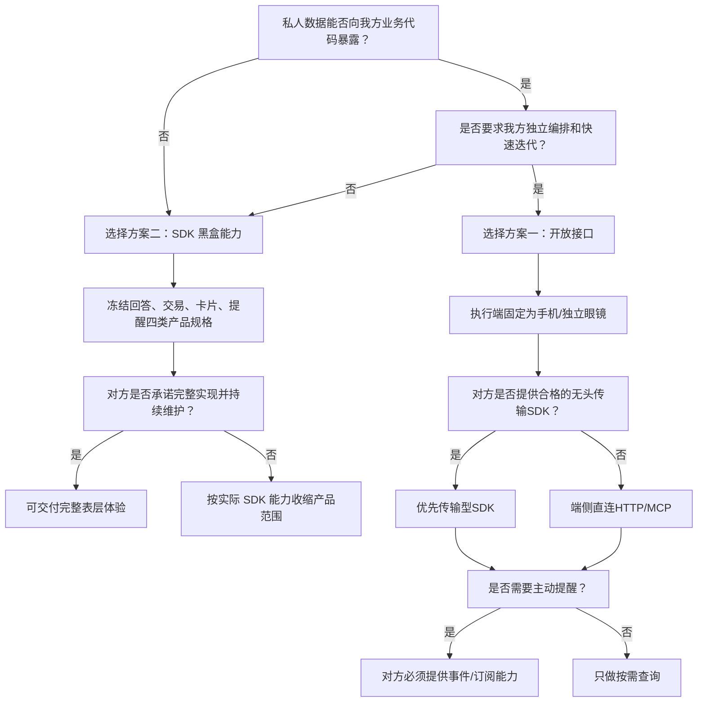

---

## 十、要求对方书面回答的问题

### 10.1 数据和授权

1. “不允许存储”的准确对象有哪些：access token、refresh token、union ID、行程 ID、订单 ID、事件码、卡片摘要是否都包含？
2. 是否确认私人数据只允许在端侧处理，不能进入我方云端内存、日志、消息队列和模型上下文？
3. 是否允许将最小字段发送给我方使用的模型服务？若允许，批准的供应商、区域和保留策略是什么？
4. 是否允许为卡片保存 opaque ID？是否允许保存有限摘要？字段和 TTL 是什么？
5. 登录采用什么 OAuth/OIDC 流程？是否支持 Authorization Code + PKCE、App Link/Universal Link、state、撤销和增量授权？
6. refresh token 能否由对方 token broker 保管，只向我方签发短时 access token？
7. scope 能否细分为公开读、私人读、订票、退票和订阅事件？
8. 用户退出、撤销授权、换机和设备丢失时，凭证多久失效？

### 10.2 能力接口

9. 是提供原子化结构化工具，还是只提供一个自然语言对话入口？
10. 私人查询能否返回稳定 schema，而不是只有文本？
11. 每条数据是否包含来源时间、版本、有效期和稳定 ID？
12. 订票和退票是否支持草稿/报价与最终确认分离？
13. 写接口是否支持幂等键、异步状态查询、取消和审计 ID？
14. 是否有沙箱、测试账号、配额、超时、SLA 和版本兼容承诺？
15. 是否提供设备订阅、opaque 系统推送、WebSocket 或 OEM 消息通道？事件如何绑定设备、去重、补偿和回放？

### 10.3 传输型 SDK

16. SDK 是否 headless，并返回稳定的结构化数据，而不是强制使用对方 UI？
17. SDK 内部如何做设备注册、attestation、token 续期、并发刷新和吊销？
18. SDK 的消息模块底层是 FCM、APNs、WebSocket 还是私有/OEM 通道？完整 payload 是否经过系统推送云？
19. SDK 会把哪些数据写入磁盘、日志、APM、崩溃信息和系统备份？默认 TTL 是多少？
20. 是否提供取消、超时、幂等、原始错误码、trace ID、离线 mock 和故障注入能力？
21. 是否提供 Android/iOS 一致 API、官方 Flutter bridge、示例工程和自动化测试接口？
22. SDK 的权限、网络域名、第三方依赖、包体、兼容矩阵、LTS 和安全更新 SLA 是什么？

### 10.4 黑盒产品 SDK

23. 查询回答、交易交互、常驻卡片、主动提醒四个能力面各自采用什么 API 和 UI 载体？
24. 私人查询是否同时支持黑盒 UI 和黑盒 TTS/音频？连续追问由什么 session 机制承接？
25. 是否提供手机及眼镜/HUD 专用呈现组件？尺寸、主题和交互如何定制？
26. 常驻卡片由谁持有状态、何时刷新、如何跨重启恢复？
27. 主动提醒由谁接收对方事件、谁决定触发、谁生成通知及眼镜内容？
28. 采用 L1 同进程、L2 独立进程还是 L3 独立应用/系统级隔离？
29. SDK 写入我方 App 沙箱的数据，在合规定义中算对方存储还是我方端侧存储？
30. 我方能拿到哪些宿主状态、结果状态和 trace ID，哪些字段被认定为用户数据？
31. SDK 崩溃、登录失效、弱网和升级不兼容时，双方各自承担什么责任？

---

## 十一、分阶段落地建议

双方先完成共同阶段 P0：定义用户场景、数据对象、隔离等级、凭证、日志、模型、卡片和通知边界，并由产品、安全和法务共同确认。随后按所选方案进入不同实施路径。

方案一实施路径：

| 阶段 | 目标 | 放行条件 | 不应提前承诺的能力 |
|---|---|---|---|
| P0.5：端侧传输定型 | 在传输型 SDK 与直连 HTTP 之间做技术准入 | SDK headless/结构化/可审计，或端侧 HTTP 鉴权与推送方案完整 | 任何正式私人数据接入 |
| P1：公开查询 | 打通公开车次/航班查询和我方卡片 | 结构化 schema、时间戳、限流、错误码 | 私人行程、交易、主动提醒 |
| P2：私人只读 | 登录、查我的行程、无痕语音回答 | PKCE、短时 token、撤销、日志扫描通过 | 订票、退票 |
| P3：交易 | 订票/退票闭环 | 两阶段交易、确认、幂等、审计、异常补偿 | 无确认自动交易 |
| P4：行程伴随 | 常驻卡片和主动提醒 | 摘要存储规则或即时取数、事件接口、去重 | 无事件源的实时提醒 |

方案二实施路径：

| 阶段 | 目标 | 对方主要交付 | 验收重点 |
|---|---|---|---|
| S1：查询回答面 | 语音问公开/私人行程，SDK 返回黑盒 UI/音频 | 查询回答组件、登录、opaque session | 我方不可见业务正文；回答区和眼镜呈现正确 |
| S2：交易交互面 | 订票和退票闭环 | 选票、确认、支付、结果组件 | 高风险确认、异常恢复、受限结果回调 |
| S3：常驻卡片面 | 手机和眼镜常驻行程卡片 | 卡片组件、刷新、重建、失效处理 | 生命周期、弱网、隐私遮挡、跨重启 |
| S4：主动提醒面 | 延误、值机、检票口等主动通知 | 云端事件、SDK 后台模块、通知/HUD/音频 | 后台限制、去重、时效、免打扰 |

方案二每完成一阶段，用户可见能力就增加一块。未交付某个能力面时，只收缩该场景，不能据此推断 SDK 方案整体做不到该场景。

---

## 十二、验收标准

### 12.1 方案一验收

- 公开查询可返回结构化结果，字段、版本、有效期和错误码符合契约；
- 用户在对方页面登录，我方任何页面、日志和抓包中均不出现账号密码；
- 撤销授权后，私人查询在约定时间内全部失败且不会自动恢复；
- 私人查询正文不进入我方云端；端侧数据库、SDK 缓存、APM、崩溃日志和系统备份也不得出现未批准副本；
- 对方服务确认调用来源为已注册设备，我方云端无法使用相同凭证直接调用；
- 传输型 SDK 模式下，结构化结果、业务错误码、取消、超时和 trace ID 符合契约，且不强制绑定对方 UI；
- 订票/退票在重复点击、网络超时、客户端重启和服务重试下不会重复执行；
- 最终执行内容与确认页逐字段一致；价格或规则变化会触发重新确认；
- 重复、乱序和延迟事件不会造成重复提醒或状态回退；
- 卡片在登录失效、弱网、数据过期和用户退出后按约定隐藏或降级；
- 每次敏感调用都有不含业务正文的审计链路，可由双方 trace ID 联合定位。

### 12.2 方案二验收

- “看下我的行程”等语音请求能在助手回答区返回对方黑盒 UI；需要纯语音时能返回或直接播放对方生成的音频；
- 连续追问由 opaque session 正确承接，我方会话中不出现私人回答正文；
- 所有意图入参、宿主参数和回调都经过 schema 校验，非法参数不会进入业务流程；
- SDK 不通过 API、回调、日志或崩溃信息向我方暴露禁止字段，我方也不通过截图、Accessibility、DOM 或 Hook 读取；
- 登录、账号切换、进程重建、弱网和授权失效行为明确；
- SDK 的崩溃率、ANR、启动时间、内存、包体和耗电满足双方指标；
- Flutter bridge 在支持的 Android/iOS 版本和 ABI 上通过 CI；
- 回调能明确区分成功、取消、处理中和失败，并提供不含业务数据的 trace ID；
- 常驻卡片在后台、进程重建、登录失效和弱网下按共同 PRD 工作；
- 主动提醒在手机后台、锁屏和眼镜链路上分别实测，内容、时效、去重和免打扰符合共同 PRD；
- L1/L2/L3 隔离等级与实际部署一致，SDK 端侧缓存的归属和清理行为可验证。

---

## 十三、最终建议

双方应先确定数据和产品控制权，再选协议形态。当前约束已经排除“我方云端代理调用对方”的部署方式。

- 若希望我方掌握统一语音、AIGUI、跨能力编排和后续迭代，选择方案一。执行位置固定在手机或独立眼镜；对方交付结构化能力、细粒度授权、两阶段交易和设备事件接口。
- 若希望私人数据和垂直业务逻辑始终留在对方边界，选择方案二。双方共同定义查询回答、交易、常驻卡片和主动提醒四类产品，对方将其完整实现在 SDK 中，我方负责 AI 入口、宿主 UI 区域和设备通道。

两种方案都能做出用户看到的完整行程助手，区别在于谁拥有这套产品的“源代码级控制权”。方案一是我方拿到能力后持续做产品；方案二是我方提出产品要求，对方持续把产品做进黑盒 SDK。

方案一内部的倾向性选择是：**手机端传输型 SDK 优先，端侧直连 HTTP 作为回退；opaque 系统推送唤醒 + 设备直连回源作为后台消息主链路，WebSocket 作为前台或 OEM 特权设备增强。**系统推送凭证默认由我方掌握，只让不可兑换的事件句柄进入推送中继；若对方连此类元数据也不允许经过我方云，再改为对方直发。这条路线让对方控制设备来源、访问凭证和回源协议，同时保留我方对结构化数据和最终产品体验的控制。

不建议采用职责含混的中间状态：接口方案只提供长期万能 key 和自然语言结果，却要求我方承担交易可靠性；SDK 方案没有冻结四类能力面的共同 PRD，却默认对方或我方会在后期自动补齐。双方应在立项时把交付物、迭代责任和验收标准落到接口或 SDK contract 上。
