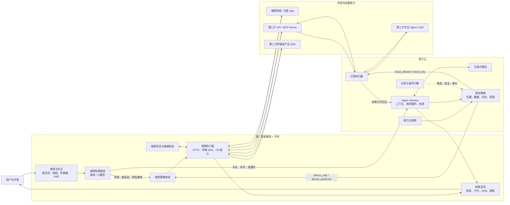
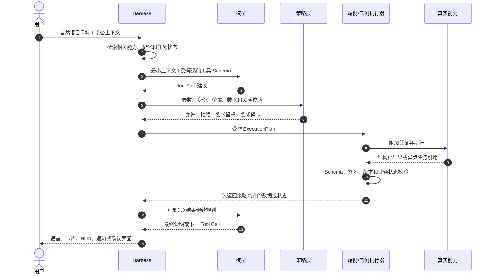
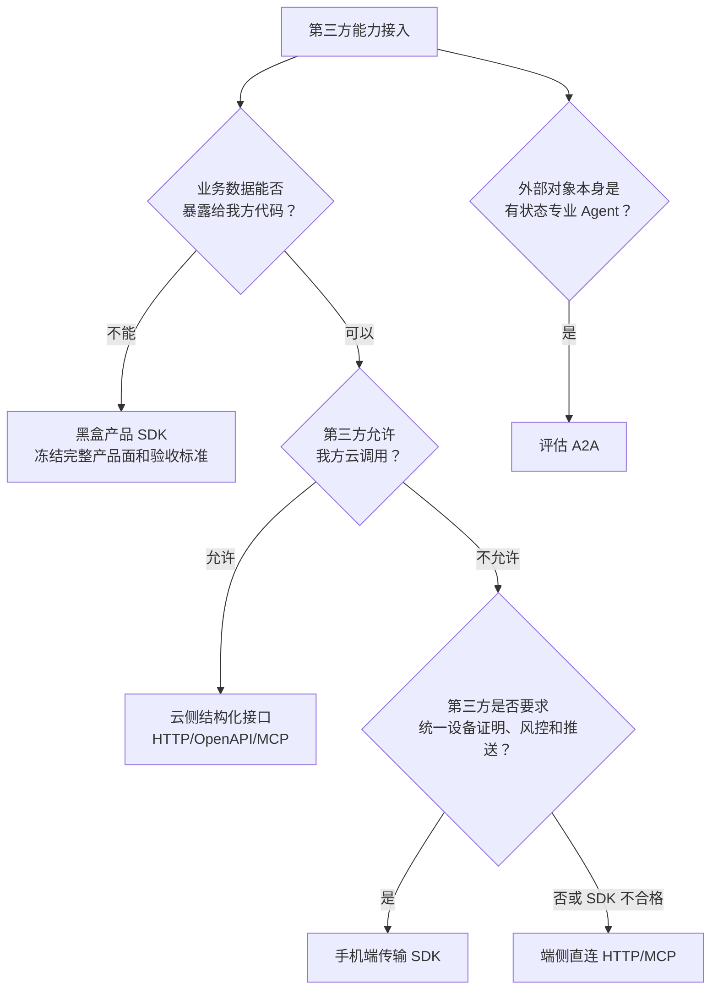
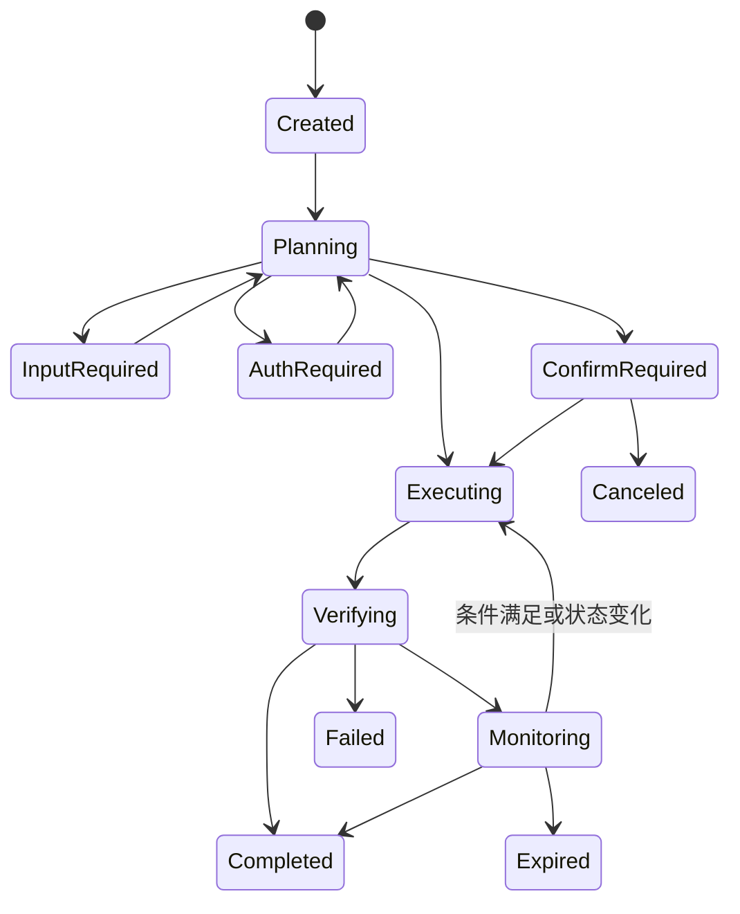

# 给 AI 装上“眼镜、耳朵、手脚”：端云融合能力平台技术调研报告

> 文档用途：给出端云融合语音助手接入任意云端/端侧能力的统一技术模型、选型边界和落地路线。  
> 编制：chenwj  
> 日期：2026-07-23  
> 状态：技术方案研究稿

配套文档：

- [端云融合语音助手：零层架构与主流程](./端云融合语音助手_零层架构与主流程.md)
- [端云融合语音助手：最长路径与二层设计前提](./端云融合语音助手_最长路径与二层设计前提.md)
- [第三方交通出行能力接入技术评估](./第三方交通出行能力接入技术评估.md)

---

## 一、30 秒结论

“给 AI 装眼镜、耳朵、手脚”不只是接入任意云端或端侧 API。

接入 API 只解决“有一条线连到了能力”。要让 AI 真正代替用户完成事情，还要让能力可被发现、可被授权、可被安全执行，并让系统知道执行结果是否真的发生。长任务还需要脱离对话上下文的持久状态，最后把结果以语音、卡片、HUD、通知或第三方 UI 交还用户。

更准确的定义是：

> “给 AI 装眼镜、耳朵、手脚”是在模型外建立一套受控闭环：感知环境，理解目标，发现能力，规划步骤，校验权限与风险，执行动作，观察真实结果，维护任务状态，再向用户呈现或继续行动。

可以写成一个工程公式：

```text
可产品化的 AI 助手
= 端云模型
 + Agent Harness
 + 能力契约与注册表
 + 云侧/端侧执行器
 + 鉴权与确定性策略
 + 任务与事件状态
 + 结果验证
 + AIGX 多端呈现
```

LLM 是其中的概率决策器，不是系统本身。模型输出的 Tool Call 只能表示“建议执行”，不能自动等价为“有权限执行”或“已经执行成功”。

推荐的总体骨架是：

> 一个统一能力模型，两套执行器（端侧、云侧），一个模型外策略闸，一个独立任务/事件引擎，再加一层多端呈现。

具体选型倾向：

- 第三方允许我方云访问：优先云侧结构化接口，便于复杂编排、长任务和统一运维；
- 第三方禁止我方云访问，但允许我方读结构化结果：优先手机端无 UI 的传输 SDK，端侧直连 HTTP/MCP 作为可控回退；
- 第三方数据不能暴露给我方：采用黑盒产品 SDK，但必须把回答、交易、常驻卡片、事件和主动提醒完整做入 SDK；
- MCP 用来标准化工具，不用来替代数据合规判断；
- A2A 只用于真正的远程专业 Agent，不为普通查询接口增加一层 Agent；
- A2UI 用于声明式结果呈现，不进入交易授权和执行的信任根。

---

## 二、先建立正确的系统直觉

### 2.1 “接入能力”为什么只完成了一半

一项能力要进入 AI 助手，至少同时满足下面 7 个条件：

| 条件 | 系统必须知道什么 | 缺失后的结果 |
|---|---|---|
| 可发现 | 能力叫什么、适合什么目标 | 模型不知道何时调用 |
| 可理解 | 输入、输出、限制、示例是什么 | 参数靠猜，结果无法稳定解析 |
| 可路由 | 只能端侧、只能云侧，还是均可 | 违反第三方调用来源或隐私约束 |
| 可授权 | 谁允许、需要什么 Scope、凭证在哪 | 能力可见但不可合法执行 |
| 可执行 | 超时、取消、重试、幂等如何处理 | Demo 能跑，故障时重复或失控 |
| 可验证 | 如何证明动作受理、完成或失败 | 模型把“已提交”说成“已完成” |
| 可呈现 | 结果如何映射到语音、卡片、HUD 和通知 | 只得到一段难用的文本 |

长期任务还需要第 8 项：可恢复状态。它不能依赖某一轮对话历史。

所以，这不是一个“API 数量”问题，而是一套运行时问题。

### 2.2 用人体比喻，只保留一次

| 比喻 | 工程对象 |
|---|---|
| 眼睛和耳朵 | 相机、麦克风、位置、日历、设备状态和第三方事件等上下文提供者 |
| 大脑 | 端侧小模型、云端大模型和规划逻辑 |
| 小脑和脊髓 | 端侧快路径、事件总线、确定性规则和实时控制 |
| 手和脚 | 云侧/端侧执行器、HTTP、SDK、OS 能力和远程 Agent |
| 本体感觉 | 工具结果、业务状态复查、设备反馈和事件回流 |
| 免疫与门禁 | 身份、授权、Scope、策略、沙箱和确认闸 |
| 记忆 | 任务状态、用户偏好和历史事实，但三者必须分开治理 |

Android 视角下，可以把 LLM 看成可替换的策略模块；Harness 更接近 `system_server` 式运行时；能力描述符类似强化版 `AndroidManifest + intent-filter`；能力执行器像受控 Binder 服务；任务引擎接近 `WorkManager/JobScheduler`，但增加了 AI 规划、跨端状态和用户确认。

### 2.3 三种“记忆”不能混在一起

| 状态 | 例子 | 是否必需 | 推荐归属 |
|---|---|---|---|
| 会话上下文 | 当前几轮说了什么 | 必需但短期 | 模型输入前由 Harness 组装 |
| 任务状态 | 订单正在出票、下一次检查时间 | 可靠执行必需 | 确定性任务引擎，不依赖模型记住 |
| 用户记忆 | 常用机场、座位偏好 | 产品可选 | 独立记忆系统，用户可见、可改、可删 |

“接入手脚”解决了模型不能作用于外部世界的问题，却没有自动解决“无记忆”。如果要缩小用户对 AGI 的期待差距，任务状态和用户记忆都要独立建设；不能把它们塞进一段越来越长的 Prompt。

---

## 三、骨干架构：三域、双执行面、一条闭环



这张图的主干只有 6 步：

```text
感知/请求
  → 路由与规划
  → 模型外策略校验
  → 选择端侧或云侧执行
  → 验证结果并更新任务状态
  → 语音、卡片、HUD 或通知
```

复杂度主要来自四条分界线：

1. 模型决策与真实执行分开；
2. 云侧规划与端侧执行分开；
3. 对话上下文与持久任务状态分开；
4. 能力结果与最终呈现分开。

---

## 四、AI 做什么，确定性系统做什么

### 4.1 推荐分工

| 环节 | AI 的职责 | 确定性系统的职责 |
|---|---|---|
| 理解请求 | 识别目标、抽取槽位、发现歧义 | 日期、时区、枚举、范围和业务规则校验 |
| 选择能力 | 从候选能力中提出调用 | 过滤未授权、不适用或位置不合法的能力 |
| 多步规划 | 根据目标和上一步结果决定下一步 | 控制最大步数、预算、超时和可调用集合 |
| 候选推荐 | 解释偏好、给出排序理由 | 硬约束过滤、价格和状态以事实源为准 |
| 写操作 | 收集信息、解释后果 | 报价、确认、幂等、执行、核单、补偿 |
| 长期任务 | 把自然语言编译成任务规则 | 调度、持久状态、重试、事件和恢复 |
| 主动提醒 | 生成简洁措辞或优先级建议 | 事件真伪、免打扰、去重、投递和卡片更新 |
| AIGX | 选择合适布局或生成受限描述 | 组件白名单、数据绑定、交易字段和动作权限 |

原则很简单：

> AI 负责语义和开放判断；确定性系统负责权限、事实、状态与不可逆动作。

把“订票前确认”写进 Prompt 不是安全机制。执行器仍要验证一份与报价、乘机人、金额、动作和失效时间绑定的确认凭证。

### 4.2 标准调用闭环



如果 `result_egress=device_only`，执行器到 Harness 的正文回流被截断。此时端侧模板、本地模型或第三方 SDK 负责最终呈现；云端只收无正文状态和遥测。

---

## 五、统一能力模型

### 5.1 先定义内部契约，再适配外部协议

平台不应让业务逻辑直接依赖某家 SDK、MCP 版本或某个模型厂商的 Tool Schema。先定义内部 `CapabilityDescriptor`，再用 Adapter 映射到 HTTP、SDK、MCP、App Functions、App Intents 或 A2A。

```yaml
id: trip.flight.search
version: 1.0.0
owner: provider_x

semantic:
  title: 查询航班
  description: 查询指定日期、出发地和目的地的可售航班
  input_schema:
    type: object
    required: [origin, destination, departure_date]
  output_schema:
    type: object
    required: [flights, source_timestamp]
  examples:
    - "明天上午深圳到北京的航班"

binding:
  protocol: provider_sdk
  adapter: provider_x_android
  execution_locations: [device]
  result_mode: structured

data_policy:
  input_class: public_query
  output_class: public_transport
  allowed_egress: [device_ui, our_cloud_ai]
  persistence: no_persist

authorization:
  principal: app_and_device
  scopes: [flight.read]
  credential_holder: provider_sdk

risk:
  level: read
  confirmation: none
  idempotency: naturally_idempotent

runtime:
  mode: synchronous
  timeout_ms: 8000
  retry: safe_with_backoff
  cancellation: supported

presentation:
  allowed: [speech, native_card, provider_ui]
  profile: flight_search_v1

observability:
  trace_id: required
  business_body_logging: forbidden
```

订票能力增加：

```yaml
risk:
  level: transaction
  confirmation: every_execution
  idempotency_key: required
  compensation: provider_cancel_or_refund

authorization:
  principal: third_party_user
  scopes: [trip.read, booking.write]

runtime:
  mode: asynchronous
  task_support: required
  outcome_verification: query_order_until_terminal
```

### 5.2 能力目录给模型看的内容要尽量少

模型只需要：

- 名称和用途；
- 输入 Schema；
- 必要的输出摘要；
- 经过审核的使用提示。

下列内容由 Harness 和策略层持有，不交给模型决定：

- 网络 endpoint 和底层密钥；
- 真实执行位置；
- 数据出域和留存规则；
- 受信风险等级；
- 超时、重试、幂等和补偿；
- 是否必须鉴权或确认。

MCP 的工具定义支持输入/输出 Schema 和结构化结果，也建议敏感操作加入用户确认。但 MCP 同时明确：来自不可信 Server 的工具注解不能直接作为安全决策依据。我方必须在受信注册表中重新审核风险属性。[MCP Tools](https://modelcontextprotocol.io/specification/2025-11-25/server/tools)

### 5.3 能力不要做得过粗

推荐：

```text
search_flights
get_user_trips
create_booking_draft
confirm_booking
quote_refund
confirm_refund
subscribe_trip_events
```

不推荐：

```text
travel_chat(query)
execute_http_request(url, method, body)
do_anything(action)
```

细粒度能力让读取、写入、报价、确认、事件和 Scope 可以分开治理，也让错误、重试和审计有明确语义。

---

## 六、端云路由与双执行器

### 6.1 端侧快路径的定位

端侧可部署唤醒词、VAD、ASR、规则分类器或小型函数调用模型，用于：

- 高频低风险请求；
- 隐私敏感、必须本地处理的请求；
- 网络差时的基础控制；
- 云端调用前的粗分流和敏感预判。

复杂多步、低置信和开放问答进入云端慢路径。两条路径最后必须经过同一个受信策略语义，不能让端侧快路径成为权限旁路。

Android 提供 `createOnDeviceSpeechRecognizer`；Android 端运行小模型和函数调用在技术上也已有官方工具链。但具体机型、语言、功耗和模型质量仍需实测。[Android SpeechRecognizer](https://developer.android.com/reference/android/speech/SpeechRecognizer.html)、[Google AI Edge Function Calling](https://ai.google.dev/edge/mediapipe/solutions/genai/function_calling/android)

### 6.2 执行位置策略

| 策略 | 含义 | 典型能力 |
|---|---|---|
| `device_only` | 三方禁止我方云访问，或能力依赖本地 App、传感器和私有数据 | 私人行程、设备控制、本地文件 |
| `device_preferred` | 隐私和时延优先，端侧不可用时才允许受控云降级 | ASR、部分公开查询 |
| `cloud_allowed` | 两侧都能执行，由时延、长任务、成本和可用性决定 | 天气、公开交通、知识查询 |
| `cloud_only` | 依赖云密钥、云内数据或可靠后台运行 | 企业 SaaS、批处理、长任务 |
| `provider_sdk_only` | 数据和流程只能留在第三方 SDK | 黑盒个人行程、支付工作流 |

执行位置不由模型填写。策略引擎计算：

```text
能力允许位置
∩ 数据出域规则
∩ 凭证位置
∩ 设备在线/系统状态
∩ 延迟与后台可靠性
∩ 当前授权和风险级别
= 合法执行节点
```

### 6.3 云端计划、端侧执行的命令契约

```yaml
plan_id: ...
capability_id: device.camera.capture
capability_version: 2.1.0
arguments: {...}
issued_at: ...
expires_at: ...
required_user_presence: true
expected_data_class: visual_private
result_egress: device_only
trace_id: ...
signature: ...
```

端侧重新检查版本、TTL、签名、用户在场、设备权限和数据策略。有任何不一致就拒绝。自然语言指令不能直接进入执行器。

---

## 七、横向比较：能力可以怎样接入

### 7.1 主要形态

| 形态 | 控制权与数据 | 适合场景 | 优点 | 代价与边界 |
|---|---|---|---|---|
| 我方云直连 HTTP/OpenAPI/MCP | 我方云获得结构化结果 | 允许我方云访问的服务 | Agent loop 完整；易编排、监控和后台运行 | 凭证与数据进入我方云处理链路 |
| 端侧直连 HTTP/MCP | 我方端侧获得结构化结果 | 三方只允许设备访问 | 透明、易替换、多厂商统一 | 我方承担网络、鉴权、重试和兼容 |
| 端侧传输 SDK | 我方获得结构化结果；三方控制网络实现 | 三方要求统一风控、签名、设备证明和推送 | 对方可收口协议演进；我方仍能做产品 | 厂商锁定、包体、稳定性、调试透明度 |
| 黑盒产品 SDK | 数据、业务和主要 UI 留在第三方 | 私人数据不暴露给我方 | 数据边界清晰；三方负责垂直业务正确性 | 我方不能自由组合内容；迭代依赖第三方 |
| Android App Functions | OS 注册本地 App 工具 | 调用已安装 App 的动作和数据 | 本地发现、参数化调用、系统权限协同 | Android 版本和调用权限限制；当前仍是实验预览 |
| Apple App Intents | App 向系统声明动作和实体 | Siri、Shortcuts、Spotlight、Widget 等 | 系统级发现和多入口复用 | 不等于任意第三方助手都能获得同等调用权 |
| 本地 MCP `stdio` | 宿主拉起本地进程 | PC 文件、开发工具、本地数据库 | 进程隔离、协议统一 | 移动端不适合照搬桌面子进程模式 |
| A2A 远程 Agent | 第三方保持内部规划和任务黑盒 | 法务、旅行、企业流程等专业 Agent | Agent Card、Task、Artifact、流和异步协作 | 普通 CRUD 不值得 A2A 化，治理和运维更重 |

截至 2026 年，Android App Functions 官方将其定位为移动端可发现、可执行的工具机制，但仍是 experimental preview，并要求调用方具备相应权限；它应作为 OEM 和 Android 生态的演进方向，不作为当前唯一生产通道。[Android App Functions](https://developer.android.com/ai/appfunctions)

Apple App Intents 用结构化动作和实体把 App 能力提供给 Siri、Shortcuts、Spotlight、Widget 等系统体验。对于我方自有助手，仍需验证平台是否开放所需调用面；不能把“App 已声明 Intent”直接等同为“我方助手可无条件执行”。[Apple App Intents](https://developer.apple.com/documentation/appintents)

### 7.2 黑盒 SDK 能做到什么

黑盒 SDK 可以做到：

- 语音请求后显示私人行程结果 UI；
- 返回或直接播放不透明的语音答案；
- 提供常驻卡片组件；
- 监听第三方事件并主动提醒；
- 完成登录、确认、支付、订票和退票工作流。

它的能力上限不是“只能打开页面”，而是“只能运行第三方已经做进 SDK 的产品”。

区别在控制权：

- 结构化接口方案是第三方给能力，我方持续做产品；
- 黑盒 SDK 方案是双方先定产品，第三方持续把产品做进 SDK，我方负责入口、宿主和设备通道。

同进程 SDK 只是不暴露公开 API，不是强安全隔离。如果合规要求“我方进程也不能触达正文”，需要第三方独立进程、受保护 Surface/Remote UI、系统级隔离或其他可验证边界。

### 7.3 选择顺序



---

## 八、协议各管一层，不要混成“万能协议”

| 层次 | 常见机制 | 它解决什么 | 它不解决什么 |
|---|---|---|---|
| Web API 描述 | HTTP、OpenAPI | 资源、动作、参数和响应 | 模型如何发现、任务状态和 UI |
| 工具协议 | Function Calling、MCP | 工具发现、Schema、调用和结果 | 数据合规、业务确认和执行位置 |
| Agent 协作 | A2A | Agent Card、消息、Task、Artifact、异步协作 | 普通本地设备 API 和最终 UI |
| OS 能力声明 | App Functions、App Intents | 本地 App 动作和实体可发现 | 跨平台统一和第三方开放权限 |
| UI 协议 | A2UI、MCP Apps、厂商 SDK UI | 声明式或沙箱化交互面 | 工具执行和交易授权 |
| 事件格式 | CloudEvents、自定义事件 Schema | 事件 ID、来源、类型、时间和数据 | 移动端后台投递可靠性 |
| 事件传输 | Webhook、WebSocket、SSE、APNs/FCM | 服务端或设备消息通道 | 业务去重、重放和状态真相 |
| 身份授权 | OAuth/OIDC、设备注册、Scope | 谁可以访问什么 | 当前交易是否已被用户确认 |

### 8.1 MCP 的正确定位

MCP 采用 Host、Client、Server 架构。Server 暴露工具、资源和提示；Host 负责权限、用户同意、模型集成和跨 Server 协调。最新规范的标准传输是 `stdio` 和 Streamable HTTP。[MCP Architecture](https://modelcontextprotocol.io/specification/2025-11-25/architecture)、[MCP Transports](https://modelcontextprotocol.io/specification/2025-11-25/basic/transports)

它适合：

- 用统一方式列出和调用工具；
- 用 JSON Schema 表达参数与结构化结果；
- 把模型供应商与能力实现解耦。

它不会自动解决：

- 请求应从端侧还是云侧发出；
- 数据是否能进入模型；
- 订票是否需要两阶段确认；
- Webhook、系统推送和常驻卡片；
- 第三方 SDK 是否是安全黑盒。

### 8.2 A2A 的正确定位

A2A 面向相互独立、内部可能不透明的 Agent。它通过 Agent Card 描述能力和认证，通过有状态 Task 处理长流程，并支持轮询、流、Artifact 和推送。[A2A Protocol](https://a2a-protocol.org/latest/specification/)

判断标准：

- 如果第三方只提供 `search_flights`、`get_order`，用 REST/MCP 即可；
- 如果第三方接收“帮我规划并办理商务差旅”，内部自己追问、规划、协作、等待和恢复，再考虑 A2A；
- 不要为了追逐协议，把一个确定性接口套成第二个大模型 Agent。

### 8.3 A2UI 的正确定位

A2UI 用流式 JSON 描述 UI，由客户端把抽象组件映射到自己的可信组件目录。它适合动态表单、组合卡片和远程 Agent 的结果面，不运行模型生成的任意代码。[A2UI Protocol](https://a2ui.org/specification/v0.9-a2ui/)

它是 AIGX 的一种呈现契约，不是能力调用协议。交易执行仍由工具和策略层控制。

---

## 九、鉴权、永久 Key 与凭证落点

### 9.1 能力风险分级

| 等级 | 示例 | 推荐控制 |
|---|---|---|
| L0 公共读取 | 公开天气、航班、高铁时刻 | 应用/设备身份、限流，无第三方用户登录 |
| L1 私人读取 | 个人行程、订单、联系人 | OAuth 最小只读 Scope，可懒鉴权 |
| L2 可逆写操作 | 创建提醒、取消预约、修改设置 | 写 Scope、动作前确认、撤销和幂等 |
| L3 交易或高影响操作 | 订票、退票、支付、发消息 | Step-up、完整摘要、一次性确认凭证 |
| L4 持续代理授权 | 条件满足后自动购买或持续执行 | 限制对象、金额、时间、次数；可撤销；执行后通知与审计 |

模型可以识别“这像一个订票意图”，但风险等级和确认方式必须来自受信注册表。

### 9.2 四层身份与权限

| 层次 | 证明什么 | 不能替代什么 |
|---|---|---|
| 我方用户身份 | 谁在使用眼镜和手机 | 第三方账号授权 |
| 应用/设备身份 | 请求来自合法客户端和设备实例 | 用户本人同意 |
| 第三方 OAuth 授权 | 用户允许访问哪些第三方资源 | 本次具体交易确认 |
| 当前动作确认 | 用户确认当前对象、金额和后果 | 长期广域授权 |

设备 attestation 只能提高“请求来自真设备”的可信度，不能证明用户同意订票。

### 9.3 凭证落点

| 调用模式 | 推荐凭证位置 | 注意事项 |
|---|---|---|
| 端侧专用 | 第三方 token broker 或 SDK 持 Refresh Token；端侧持短期 Access Token/opaque handle | 使用 Keystore/Keychain 保护，设备丢失可吊销 |
| 云侧直连 | KMS/HSM 支持的服务端 Vault，终端只持绑定状态或会话句柄 | 只有第三方明确允许云处理时成立 |
| 端云均可 | 分别签发不同 audience 和 Scope 的 Token | 不跨边界复用同一 Bearer Token |
| 黑盒 SDK | 第三方 SDK 或独立进程内部 | 我方只见登录态、技术状态和 opaque 引用 |

原生 App 使用外部浏览器或第三方 App 完成 Authorization Code + PKCE；不要让模型或我方 WebView 接触账号密码。RFC 8252 对 Native App 的外部 user-agent 和 PKCE 给出了明确要求。[RFC 8252](https://www.rfc-editor.org/rfc/rfc8252.html)

Token 应最小 Scope、短时、限定目标资源，并使用轮换或发送者约束降低被盗后的重放风险。[RFC 9700](https://www.rfc-editor.org/rfc/rfc9700.html)、[RFC 8707](https://www.rfc-editor.org/rfc/rfc8707.html)、[RFC 9449](https://www.rfc-editor.org/rfc/rfc9449.html)

MCP 安全指南也明确反对把收到的 Token 原样透传给下游服务，因为这会破坏 audience、审计和下游安全边界。[MCP Security Best Practices](https://modelcontextprotocol.io/docs/tutorials/security/security_best_practices)

### 9.4 “永久 Key”怎么处理

长期有效、同时具备个人读取和交易权限的万能 Key 不应进入正式方案。如果第三方暂时只能提供长期 Key，至少要求：

- 单用户或单安装实例，不是所有 App 共用；
- 读取、写入、支付分 Scope；
- 服务端可撤销、轮换和查看活跃设备；
- 绑定设备密钥或证明机制；
- 只存在系统安全存储或第三方 SDK；
- 不进入模型、Prompt、日志、埋点、崩溃信息和剪贴板；
- 设立向短期 Access Token + Refresh 机制迁移的时间表。

### 9.5 前置授权还是懒授权

不是全局二选一：

```text
公开查询            → 不要求第三方用户登录
第一次私人查询       → 懒授权
用户启用主动行程服务 → 前置只读授权和事件订阅
第一次交易           → 增量写 Scope
每次高风险动作       → 绑定当前快照再次确认
```

---

## 十、数据策略：调用位置、处理和存储分别写

“不存储”不是一个足够明确的工程要求。需要分别定义：

| 动作 | 问题 |
|---|---|
| 采集 | 谁拿到了原始音频、图像、位置或行程？ |
| 传输 | 数据经过端、我方云、模型供应商还是第三方云？ |
| 处理 | 哪一方代码或模型读取并转换数据？ |
| 临时缓存 | 是否允许为渲染、重试、弱网短暂停留？ |
| 持久化 | 是否跨请求、跨进程、跨重启保留？ |
| 日志与观测 | access log、trace、崩溃转储是否形成副本？ |
| 训练与评测 | 数据是否进入模型训练、人工标注或回放集？ |
| 呈现 | 锁屏、眼镜、截图和系统通知历史是否暴露？ |

数据分类建议：

| 类别 | 示例 | 默认策略 |
|---|---|---|
| Public | 天气、公开航班 | 可云处理，仍控制来源与新鲜度 |
| Personal | 个人行程、日历 | 最小字段、按 Scope、默认不进普通日志 |
| Sensitive | 身份证、支付、精确位置、连续音视频 | 端侧/第三方优先，严格限制模型和存储 |
| Transaction | 报价、订单、退款状态 | 事实源优先、快照确认、审计但正文最小化 |

两个常见误区：

- 端侧请求不代表数据一定留在端侧；结果上传到云端模型后，云端仍然参与处理。
- 数据不落数据库不代表没有存储；日志、队列、APM、崩溃文件、会话历史和系统备份都可能形成副本。

---

## 十一、感知与上下文：真正的“眼睛和耳朵”

外部工具是被调用的能力；相机、麦克风、位置和活动状态更多时候是上下文流。两者不要都粗暴注册成同一种 Tool。

### 11.1 Context Provider 契约

```yaml
context_type: device.location
source: phone_gnss
captured_at: 2026-07-23T10:00:00+08:00
freshness_ttl: PT2M
confidence: 0.83
precision: city
consent: foreground_session
allowed_consumers: [local_router, cloud_trip_planner]
retention: memory_only
```

视觉和音频上下文还应声明：

- 是持续流还是按需采样；
- 原始数据是否出端；
- 是否先做端侧检测、裁剪、OCR 或摘要；
- 旁观者、敏感场所和锁屏状态下的采集限制；
- 用户能否看见当前正在使用的传感器。

默认策略应是事件触发、按需采样和端侧预处理，不持续把原始相机与麦克风流送进云端。眼镜厂商的独特优势不是“再接一个模型”，而是能把第一视角上下文、硬件输入、手机状态和即时反馈组织成质量更高的上下文。

### 11.2 上下文也必须有出处和时效

模型收到“用户在机场”时，系统还要知道：

- 来源是 GNSS、蓝牙信标、日历推断，还是用户口述；
- 发生时间；
- 置信度；
- 是否允许用于当前能力；
- 过期后是否重新采集。

没有这些元数据，所谓“主动思考”很容易把过期或猜测信息当成事实。

---

## 十二、任务与事件：从一次问答走向持续服务

### 12.1 对话不是任务数据库

任务至少包含：

```yaml
task_id: ...
goal: ...
state: waiting_condition
policy_snapshot: ...
capability_versions: [...]
next_trigger: ...
confirmation_receipt: ...
idempotency_key: ...
result_reference: ...
last_event_cursor: ...
expires_at: ...
```

私人数据禁止进云时，云端只保存获准的 opaque `task_id`、抽象状态、触发时间和设备路由；具体行程、订单、乘机人和卡片正文留在端侧或第三方。

### 12.2 通用状态机



这类状态与 A2A 的有状态 Task 思路一致，但内部不必强制使用 A2A。协议是外部互操作方式，状态机是产品可靠性的基础。

### 12.3 事件模型

```yaml
event_id: evt_123
source: provider_x/trip
type: com.provider.trip.gate_changed.v1
subject: opaque_trip_7fd
revision: 19
occurred_at: 2026-07-24T07:10:00+08:00
expires_at: 2026-07-24T08:00:00+08:00
payload_ref: opaque_abc
trace_id: ...
```

CloudEvents 的 `id + source` 重复识别、`type`、`subject` 和 `time` 等字段可作为事件信封参考。[CloudEvents Specification](https://github.com/cloudevents/spec/blob/main/cloudevents/spec.md)

消费端还需要：

- 验签；
- `event_id` 去重；
- `revision` 或 cursor 处理乱序；
- 过期检查；
- 至少一次投递下的幂等消费；
- 丢事件后的全量同步；
- 授权撤销后的订阅清理。

### 12.4 Webhook、WebSocket 和系统推送怎么选

| 通道 | 适合 | 不适合 |
|---|---|---|
| Webhook | 三方云到我方云的可靠服务端事件 | 第三方明确禁止我方云接触该事件或数据 |
| WebSocket/SSE | App 前台实时状态、流式交互 | 普通移动端后台唯一通道 |
| APNs/FCM/OEM 消息 | 后台唤醒和可见通知 | 承诺百分之百实时、在载荷中携带完整敏感正文 |
| SDK 私有消息服务 | 第三方需要收口订阅、推送和回源 | 不说明凭证、后台行为和数据流的黑盒依赖 |

推荐移动端后台链路：

```text
第三方事件
  → APNs/FCM/OEM 发送 opaque 事件句柄
  → 唤醒端侧
  → 端侧使用自己的短期凭证直连第三方取详情
  → 验签、去重、版本检查
  → 更新卡片和提醒
```

Android Doze 会限制后台网络；iOS 后台更新也不保证送达。因此必须提供前台同步、打开卡片补拉和状态过期提示。[Android Doze](https://developer.android.com/training/monitoring-device-state/doze-standby)、[FCM Message Priority](https://firebase.google.com/docs/cloud-messaging/android-message-priority)、[Apple Background Updates](https://developer.apple.com/documentation/usernotifications/pushing-background-updates-to-your-app)

---

## 十三、AIGX：从答案到可操作界面

AIGX 不只是把一段文字换成卡片。它应把能力结果、任务状态、可用动作和风险提示投影到当前设备最合适的交互面。

### 13.1 四种呈现等级

| 等级 | 形态 | 推荐用途 | 控制边界 |
|---|---|---|---|
| 固定模板 | 程序员预制的航班、订单、确认卡片 | 高频、交易、高风险 | 字段和动作完全可测试 |
| 参数化 Widget | 结构化数据驱动已注册 Widget | 天气、行程、设备状态 | 我方控制组件和数据绑定 |
| 声明式生成 UI | A2UI 等受限 JSON 映射可信组件 | 低频组合、动态表单 | 模型只能使用组件目录 |
| 第三方黑盒 UI | SDK View、卡片、受保护 Surface | 数据必须留在第三方 | 样式和逻辑由第三方实现 |

### 13.2 语音、手机和眼镜不是同一张 UI 缩放

同一个能力结果应有 `presentation_profile`：

```yaml
speech:
  max_duration_sec: 12
  primary_fields: [best_option, price, departure_time]

phone_card:
  template: flight_candidates_v2
  actions: [open_detail, select, change_filters]

glasses_hud:
  max_lines: 4
  actions: [next, confirm_on_phone]

notification:
  privacy: hide_sensitive_on_lock_screen
  actions: [view]
```

眼镜负责“此刻最需要看见和听见的内容”，手机承载详细比较、登录和高风险确认。交易确认卡片应固定结构，不能让模型自由省略金额、乘机人、时间或退改后果。

### 13.3 UI 动作仍然是能力调用

A2UI 按钮或 Widget 点击不能直接触发任意网络请求。客户端把动作映射回受信 `capability_id`，再次经过权限、风险和确认校验。

---

## 十四、反馈与验证：系统必须知道手脚做了什么

```text
HTTP 200
≠ 业务受理
≠ 业务成功
≠ 现实世界结果已经发生
```

以订票为例：

```text
create_order 返回成功
≠ 已支付
≠ 已出票
≠ 航司最终确认
```

闭环至少包含：

1. 输入 Schema 校验；
2. 权限和策略校验；
3. 请求受理状态；
4. 业务状态二次查询；
5. 异步终态；
6. 用户可见反馈；
7. 失败补偿或售后入口。

建议贯通以下标识：

```text
trace_id          一条分布式链路
tool_call_id      一次模型工具建议
task_id           跨多次交互的长期任务
operation_id      一次业务操作
idempotency_key   防止重复写入
confirmation_id   用户确认的快照
provider_ref      第三方事实标识
```

OpenTelemetry 的上下文传播和 Trace/Span 模型适合串联云端、设备执行器和第三方 Adapter，但不得把私人正文放进 Span attributes 或 Baggage。[OpenTelemetry Traces](https://opentelemetry.io/docs/concepts/signals/traces/)

---

## 十五、安全和审计硬规则

1. 凭证永远不进入模型上下文。
2. 模型不能决定自己是否有权限，也不能修改能力风险等级。
3. 端侧快路径与云端慢路径经过同一套策略语义。
4. 工具返回值是外部不可信数据，不执行其中的自然语言指令。
5. 不向模型暴露通用 `execute_http_request`、Shell 或任意 URL 工具。
6. 读、报价、确认和执行拆成不同能力与 Scope。
7. 高影响动作展示完整、不可截断的执行摘要。
8. 写操作使用幂等键，超时先核单，不盲目重试。
9. 私人数据默认不进普通日志、APM、崩溃转储和对话历史。
10. 每次高影响动作保留用户、设备、任务、策略版本、确认快照和第三方事实标识之间的审计关系。
11. 本地 SDK、MCP Server 和 OS 工具按最小权限运行，并有签名、版本和供应链审查。
12. 用户可以查看已连接服务、授权 Scope、活跃长期任务和撤销入口。

间接 Prompt Injection 的本质是把外部数据中的恶意文本误当成系统指令。NIST 的 Agent 安全研究把这类 Agent hijacking 作为现实攻击面；所以工具输出必须在数据通道中处理，不能提升为受信指令。[NIST：Strengthening AI Agent Hijacking Evaluations](https://www.nist.gov/news-events/news/2025/01/technical-blog-strengthening-ai-agent-hijacking-evaluations)

MCP 官方也要求工具输入校验、访问控制、限流、结果清洗，客户端应对敏感操作确认并在交给模型前验证结果。[MCP Tools Security Considerations](https://modelcontextprotocol.io/specification/2025-11-25/server/tools)

---

## 十六、纵向演进：从命令词到端云持续任务

| 阶段 | 主要形态 | 解决的问题 | 仍然缺少什么 |
|---|---|---|---|
| 命令词 | 固定语法 → 固定动作 | 用语音代替点击 | 表达和能力都写死 |
| Intent + Slots | 意图分类、槽位抽取 | 容忍更多自然语言 | 每个场景仍要人工写流程 |
| Function Calling | 模型输出结构化函数和参数 | 动态选择能力 | 工具连接、权限、状态各自建设 |
| Agent Loop | 思考 → 行动 → 观察循环 | 根据结果执行多步任务 | 缺少统一协议和持久任务治理 |
| MCP 工具生态 | 工具发现、Schema、调用与能力协商 | 降低模型与工具接入成本 | 不决定合规、位置和产品 UI |
| A2A 专业 Agent | Agent Card、Task、Artifact 和异步协作 | 跨组织委托完整目标 | 不替代设备工具或交互协议 |
| 端云持续助手 | 端侧感知/执行＋云端推理＋任务/事件 | 低延迟、隐私、多端和主动服务 | 需要完整策略、安全、状态和运营体系 |

ReAct 论文把推理和行动交错，并用外部环境反馈继续规划；Toolformer 研究模型何时调用 API、调用哪个 API、给什么参数以及如何吸收结果。它们说明“会调用工具”是模型能力的一部分，但没有替代宿主运行时。[ReAct](https://arxiv.org/abs/2210.03629)、[Toolformer](https://arxiv.org/abs/2302.04761)

纵向演进真正改变的是契约边界：

```text
固定命令
  → 语义意图
    → 结构化工具
      → 可发现的工具生态
        → 跨组织的有状态任务
          → 端云协同、事件驱动的持续服务
```

有一条原则从未改变：模型提出动作，确定性系统验证并执行动作。

---

## 十七、横纵交叉后的五个判断

### 17.1 协议标准化会降低接入成本，但不会替代产品运行时

MCP、A2A、A2UI 会减少 Adapter 重复劳动，却不会替我方决定数据边界、确认策略、任务状态和多端体验。平台价值仍在 Harness、策略、状态和设备上下文。

### 17.2 设备端不是云端的薄 UI，而是隐私和执行的强边界

只要存在 `device_only` 能力，端侧就必须具备真正的能力网关、凭证保护、策略执行、任务检查点和本地呈现。否则云端计划一遇到不能回云的数据就会断裂。

### 17.3 黑盒 SDK 可以达到功能表象一致，达不到编排权一致

查询、卡片、提醒和交易都能做，关键在第三方是否愿意交付。差别是新增场景由我方组合已有能力，还是重新等待第三方设计、开发和发版。

### 17.4 “主动思考”不是让大模型常驻轮询

AI 在任务创建时把自然语言编译为触发条件、规则和动作；确定性任务引擎长期等待。事件发生后，只有语义判断或表达需要时才唤起模型。这样更省电、更可测，也更容易审计。

### 17.5 设备厂商的差异化不在工具数量

通用 API 和模型都可以买到。设备厂商更难复制的资产是：

- 第一视角、实时、带权限的端侧上下文；
- 眼镜、手机、音频、HUD 和通知的一体化反馈；
- OEM 级设备身份、后台通道和本地执行；
- 用户愿意长期授权的信任关系；
- 把这些能力组织成稳定闭环的 Harness。

这也是“站在技术与人文的交叉点”落到工程上的位置：不是让技术尽可能复杂，而是让用户只需要表达目标，同时仍然知道系统看见了什么、准备做什么、已经做成了什么，并且随时能拒绝和撤销。

---

## 十八、推荐平台方案

### 18.1 逻辑模块

```text
1. User Surface
   眼镜语音/HUD、手机、通知、卡片

2. Context Gateway
   ASR、相机/位置/设备状态、来源/时效/权限

3. Router + Agent Harness
   端侧快路径、云端规划、上下文组装、模型抽象

4. Capability Registry
   语义、Schema、版本、位置、数据、风险、呈现

5. Policy & Authorization
   Scope、凭证、确认、数据出域、执行节点

6. Execution Fabric
   云执行器、端执行器、HTTP/MCP/SDK/OS/A2A Adapter

7. Task & Event Engine
   持久状态、调度、幂等、事件、恢复、补偿

8. Presentation Runtime
   TTS、固定卡片、Widget、A2UI、黑盒 SDK UI

9. Observability & Audit
   Trace、策略决策、确认快照、结果状态、脱敏审计
```

### 18.2 物理部署倾向

| 位置 | 推荐承载 |
|---|---|
| 智能眼镜 | 麦克风、扬声器、相机触发、传感器、轻量 HUD、快速确认入口 |
| 手机 | ASR/快速路由、端侧策略与执行器、SDK、凭证、登录、详细 UI、眼镜代理 |
| 我方云 | 云端模型、Harness、能力注册表、非敏感任务状态、云侧执行器、统一运维 |
| 第三方 | 授权、数据事实、业务规则、订单、事件源；黑盒方案下还负责 UI 和工作流 |

手机是默认端侧能力宿主。只有具备独立网络、系统浏览器、安全存储和后台能力的独立眼镜，才把相同逻辑角色搬到眼镜 SoC；分层不变。

### 18.3 交通合作的具体倾向

结合“第三方不希望我方阿里云访问其数据”的现有约束，优先顺序是：

1. 手机端无 UI 传输 SDK，向我方返回结构化数据；
2. SDK 质量或平台覆盖不达标时，手机端直连 HTTP/MCP；
3. 私人数据不能暴露给我方业务代码时，采用黑盒产品 SDK；
4. 后台提醒采用 opaque 系统推送唤醒 + 端侧回源；WebSocket 只做前台或 OEM 增强。

传输 SDK 的准入条件：headless、结构化结果、原始错误码、取消/超时、线程模型、可测试桩、数据与域名清单、无隐式正文日志、LTS 与兼容策略。缺一项都可能把“合规收益”变成不可观测的高权限依赖。

---

## 十九、落地路线图与验收门槛

### P0：能力内核

交付：

- `CapabilityDescriptor`；
- 端侧和云侧执行器接口；
- 位置/数据/风险策略；
- 两个公开只读能力；
- Schema 校验、统一错误和 Trace ID。

放行标准：模型不接触 endpoint 凭证；任意非法位置和非法参数都被策略层拒绝。

### P1：私人只读

交付：

- OAuth + PKCE；
- 懒鉴权和断点恢复；
- 端侧安全凭证；
- 个人行程查询；
- 无痕数据通道和日志扫描。

放行标准：自动化测试证明私人正文不会进入我方云、普通日志、崩溃信息和会话历史；撤销授权后凭证和订阅按 SLA 失效。

### P2：高风险交易

交付：

- 查询、报价、确认、执行分离；
- 固定交易确认卡片；
- 一次性确认凭证；
- 幂等、核单、取消和补偿；
- 完整审计。

放行标准：故障注入下重复订单为 0；任何价格、对象和规则变化都会使旧确认失效；超时不会被误报为成功或失败。

### P3：持续任务与主动服务

交付：

- 独立任务状态机；
- 条件触发；
- 事件订阅、验签、去重和重同步；
- opaque 推送唤醒 + 回源；
- 常驻卡片和多端提醒。

放行标准：设备重启、断网、重复事件、乱序事件和推送丢失后都能恢复到正确状态；过期数据有明确 UI。

### P4：平台化

交付：

- HTTP、SDK、MCP、App Functions、App Intents、A2A Adapter；
- 能力审核、签名、版本与兼容治理；
- A2UI 受限组件目录；
- 工具选择、参数、策略和安全评测集。

放行标准：新增能力不改动核心 Harness；协议升级可灰度和回滚；每个能力有明确 Owner、SLA、Scope、数据和呈现契约。

### 核心指标

| 指标 | 说明 |
|---|---|
| Tool 选择准确率 | 是否选对能力，是否该追问时追问 |
| 参数完整率 | 日期、时区、对象、金额等是否准确 |
| 策略绕过数 | 目标必须为 0 |
| 敏感数据非法出域数 | 目标必须为 0 |
| 重复写操作数 | 订票、支付、退票等目标必须为 0 |
| 结果状态误报率 | `PENDING`、`UNKNOWN` 不得说成成功 |
| 任务恢复成功率 | 断网、重启和超时后恢复到正确检查点 |
| 事件新鲜度与去重率 | 量化提醒延迟、重复和过期状态 |
| 首次响应与完成时延 | 快路径、慢路径、异步任务分别统计 |
| 用户撤销完成时间 | 权限、任务、订阅和缓存清理的实际 SLA |

---

## 二十、最终判断

用户提出的“有限能力、有限规则，由 AI 灵活使用，缩小当前智能设备与用户期待的 AGI 之间的差距”是准确的产品抽象。工程上还要补一句：

> 有限能力和有限规则只有放进受控、可观察、可恢复的执行闭环，才会成为产品；否则只是一次模型演示。

“给 AI 装眼镜、耳朵、手脚”的完整含义是：

- 用设备和第三方上下文让它能感知；
- 用统一能力契约让它知道自己能做什么；
- 用端云 Harness 让它能规划和调度；
- 用凭证、策略和确认让它只做被允许的事；
- 用双执行器让动作落在合法位置；
- 用结果验证和事件回流让它知道事情是否真的发生；
- 用任务状态让它跨时间继续工作；
- 用语音、卡片、HUD、通知和黑盒 UI 把结果交还用户。

API 是手脚的接口。Harness、状态、策略、反馈和呈现，才把大脑与现实世界连成一个可用的身体。

---

## 二十一、参考资料

### 工具、Agent 与 UI 协议

- [MCP Architecture](https://modelcontextprotocol.io/specification/2025-11-25/architecture)
- [MCP Tools](https://modelcontextprotocol.io/specification/2025-11-25/server/tools)
- [MCP Transports](https://modelcontextprotocol.io/specification/2025-11-25/basic/transports)
- [MCP Authorization](https://modelcontextprotocol.io/specification/2025-11-25/basic/authorization)
- [MCP Security Best Practices](https://modelcontextprotocol.io/docs/tutorials/security/security_best_practices)
- [A2A Protocol Specification](https://a2a-protocol.org/latest/specification/)
- [A2A Agent Discovery](https://a2a-protocol.org/latest/topics/agent-discovery/)
- [A2UI Protocol v0.9](https://a2ui.org/specification/v0.9-a2ui/)
- [CloudEvents Specification](https://github.com/cloudevents/spec/blob/main/cloudevents/spec.md)

### 端侧能力与系统集成

- [Android App Functions](https://developer.android.com/ai/appfunctions)
- [Android SpeechRecognizer](https://developer.android.com/reference/android/speech/SpeechRecognizer.html)
- [Google AI Edge Function Calling](https://ai.google.dev/edge/mediapipe/solutions/genai/function_calling/android)
- [Apple App Intents](https://developer.apple.com/documentation/appintents)

### 身份与授权

- [RFC 8252：OAuth 2.0 for Native Apps](https://www.rfc-editor.org/rfc/rfc8252.html)
- [RFC 9700：OAuth 2.0 Security Best Current Practice](https://www.rfc-editor.org/rfc/rfc9700.html)
- [RFC 8707：Resource Indicators for OAuth 2.0](https://www.rfc-editor.org/rfc/rfc8707.html)
- [RFC 9449：DPoP](https://www.rfc-editor.org/rfc/rfc9449.html)
- [RFC 8628：OAuth Device Authorization Grant](https://www.rfc-editor.org/rfc/rfc8628.html)

### 后台运行、研究与安全

- [Android Doze and App Standby](https://developer.android.com/training/monitoring-device-state/doze-standby)
- [FCM Android Message Priority](https://firebase.google.com/docs/cloud-messaging/android-message-priority)
- [Apple Background Updates](https://developer.apple.com/documentation/usernotifications/pushing-background-updates-to-your-app)
- [OpenTelemetry Traces](https://opentelemetry.io/docs/concepts/signals/traces/)
- [ReAct](https://arxiv.org/abs/2210.03629)
- [Toolformer](https://arxiv.org/abs/2302.04761)
- [NIST：Strengthening AI Agent Hijacking Evaluations](https://www.nist.gov/news-events/news/2025/01/technical-blog-strengthening-ai-agent-hijacking-evaluations)
